# DriftingBlue6 — OffSec Play Lab Write-up

> **Platform:** OffSec Play  
> **Lab:** DriftingBlue6  
> **Focus:** Web enumeration → Textpattern discovery → Credential extraction → File upload → Reverse shell → Kernel exploitation → Root  
> **Difficulty:** Intermediate  
> **Status:** Rooted

---

## Overview

This write-up documents the complete compromise path for the **DriftingBlue6** machine from the OffSec Play Lab.

The attack chain starts with basic network and web enumeration, followed by discovery of a **Textpattern** installation. Further directory enumeration leads to a password-protected ZIP archive containing credentials. Those credentials provide access to the Textpattern interface, where a PHP reverse shell can be uploaded and executed.

After obtaining a shell, local privilege-escalation enumeration reveals an outdated kernel vulnerable to **Dirty COW**. Exploiting the kernel vulnerability provides a root shell and access to the final flag.

### Attack Path

```text
Nmap
  │
  ▼
Web Enumeration
  │
  ▼
Textpattern Discovery
  │
  ▼
Directory Fuzzing
  │
  ▼
Password-Protected ZIP
  │
  ▼
Credential Recovery
  │
  ▼
Textpattern Login
  │
  ▼
PHP File Upload
  │
  ▼
Reverse Shell
  │
  ▼
Kernel Enumeration
  │
  ▼
Dirty COW
  │
  ▼
Root
  │
  ▼
Flag
```

---

## 1. Initial Enumeration

The first step was a standard Nmap scan against the target.

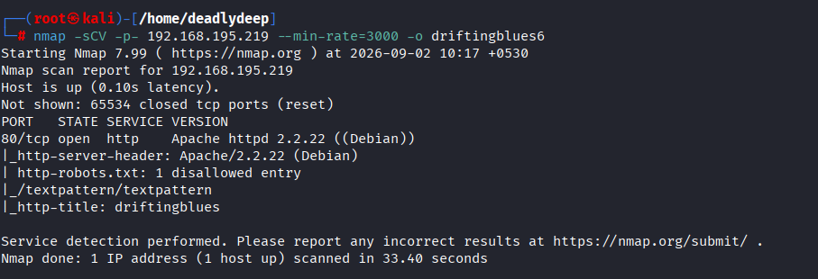

A closer look at the web service revealed the target's website.

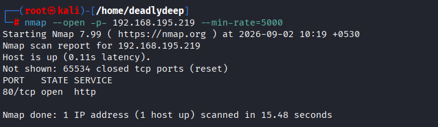

Inspecting the page source provided another useful clue.

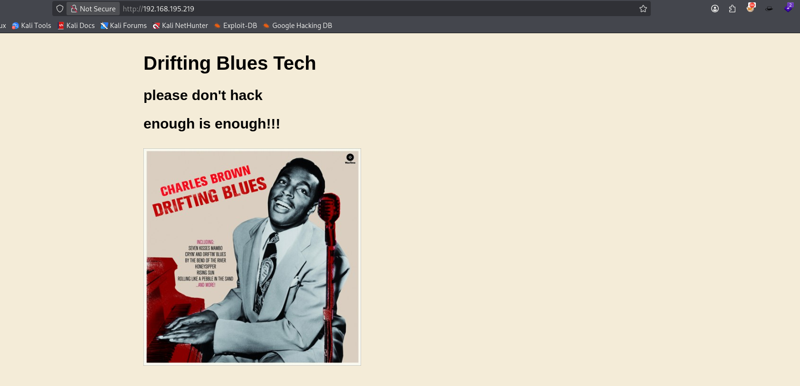

---

## 2. Directory Enumeration

With the web service identified, the next step was directory enumeration.


I also experimented with `.zip` extensions and multiple wordlists, but the initial attempts did not produce anything useful.


The `/textpattern/textpattern` path, however, exposed a Textpattern installation.

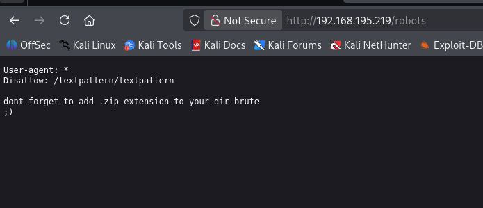

This became the main target for further enumeration.

---

## 3. Enumerating Textpattern

I performed directory fuzzing against the newly discovered Textpattern directory.


The `/setup` directory revealed the following:


The `/lib` directory also returned interesting content:


Neither location immediately provided a usable path to compromise the machine.

After going through additional wordlists and continuing the enumeration, I eventually found a promising archive.

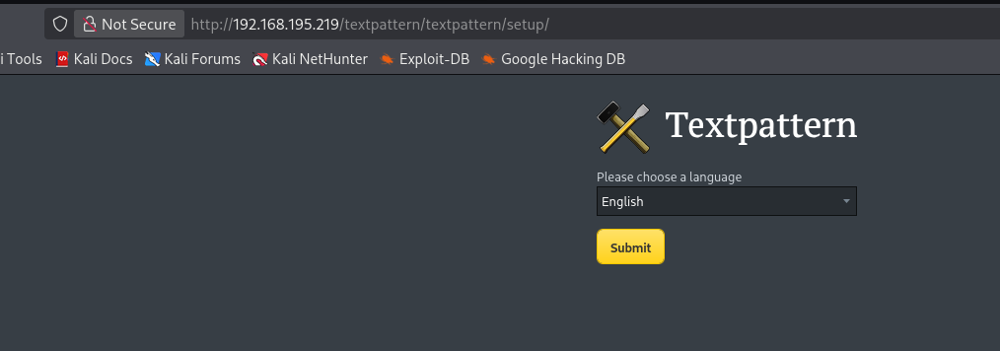

---

## 4. Recovering Credentials

The ZIP archive was password protected.

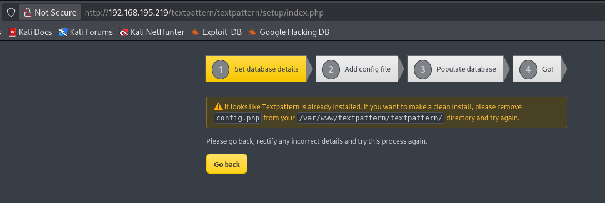

I attempted to recover the password using `rockyou.txt`.


After successfully extracting the archive, I found a credentials file.

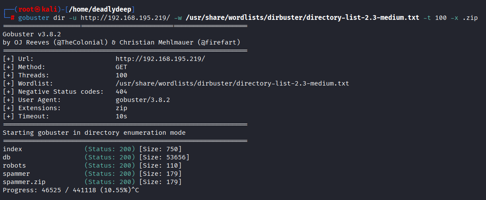

The recovered credentials could then be tested against the Textpattern login interface.

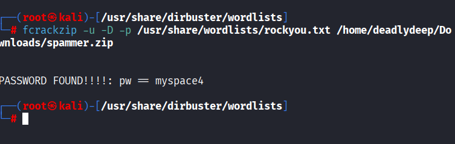

The credentials worked.

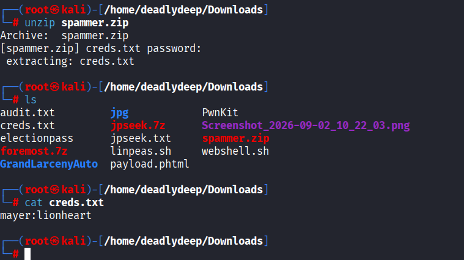

---

## 5. Obtaining a Reverse Shell

After authenticating to Textpattern, a file-upload functionality was available.


I uploaded a PHP reverse shell. The shell used here was the PHP reverse shell from **pentestmonkey**.


On the attacking machine, I started a Netcat listener.

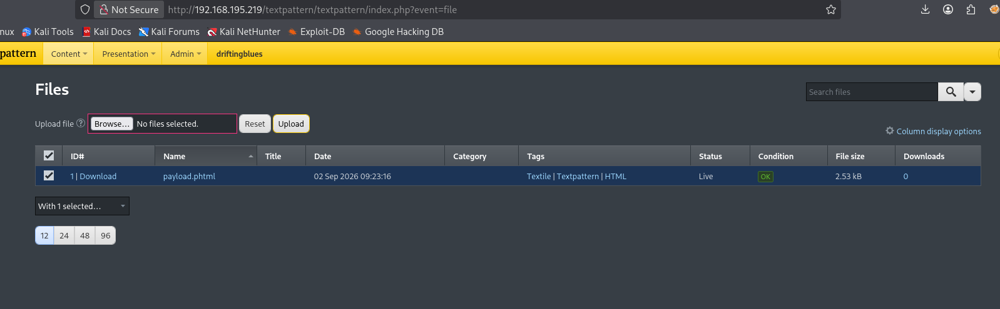

I then visited the uploaded PHP file so that the server would execute it.

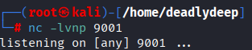

The callback succeeded, giving me a shell on the target.


---

## 6. Shell Stabilization

The initial shell was unstable, so I stabilized it before continuing with local enumeration.


---

## 7. Privilege Escalation Enumeration

I first attempted to locate `local.txt`, but could not find the user flag.

I then moved on to privilege-escalation enumeration. There were no useful `sudo` permissions, and the available SUID binaries did not provide an obvious escalation path.

The next logical step was checking the kernel version.


Searching for vulnerabilities associated with the identified kernel version revealed a potential **Dirty COW** attack path.


The machine was vulnerable to Dirty COW, so I decided to transfer a Dirty COW exploit from the attacking machine to the target.

---

## 8. Dirty COW Exploitation

The Dirty COW exploit was obtained for use against the vulnerable kernel.

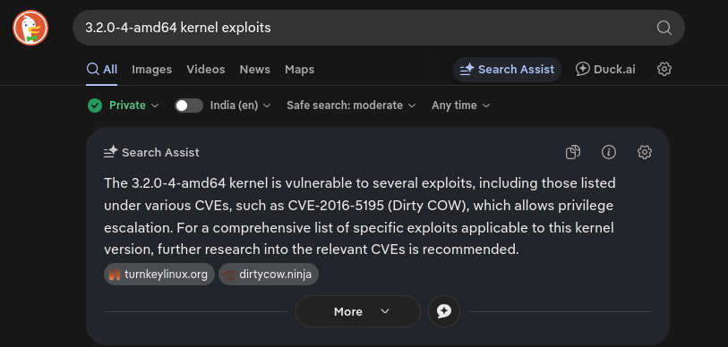

I hosted the exploit from the attacking machine using a Python HTTP server bound to the attacker interface.


The exploit was then downloaded to the target and compiled.

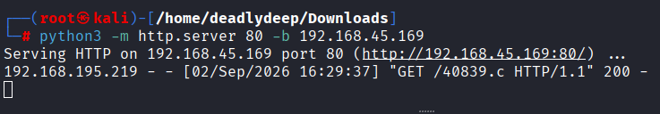

After executing the exploit, it prompted for a new password.

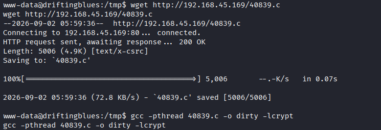

I supplied a new password and then switched to the root account using that password.


The root shell was successfully obtained.

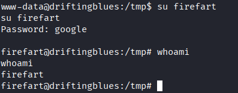

With root access, the final flag could be retrieved.


---

## 9. Compromise Summary

| Phase | Technique |
|---|---|
| Reconnaissance | Nmap scanning |
| Web Enumeration | Directory fuzzing |
| Application Discovery | Textpattern |
| Credential Access | Password-protected ZIP cracking |
| Initial Access | Textpattern file upload |
| Shell Access | PHP reverse shell |
| Privilege Escalation | Dirty COW |
| Final Access | Root |

### Key Lessons

- Do not stop after finding the main web application; enumerate its directories and subdirectories.
- CMS installations can expose useful files and administrative interfaces.
- Password-protected archives discovered during enumeration can contain credentials or configuration data.
- File-upload functionality should always be assessed carefully for executable-file upload and execution.
- Once a shell is obtained, enumerate the kernel version and other local privilege-escalation vectors.
- Outdated Linux kernels can expose serious privilege-escalation vulnerabilities such as Dirty COW.

---

## Disclaimer

This write-up is intended for **authorized security labs and educational environments** such as OffSec Play Lab. Do not apply these techniques to systems without explicit permission.

---

## Credits

- **Lab:** OffSec Play — DriftingBlue6
- **PHP reverse shell:** pentestmonkey
- **Privilege escalation:** Dirty COW

---

*Write-up reconstructed and formatted from the original lab notes and screenshots.*
