# Drifting Blue 6 - OffSec Play Lab Writeup

> A comprehensive security assessment and exploitation walkthrough of the Drifting Blue 6 lab environment

## 📋 Table of Contents
- [Overview](#overview)
- [Reconnaissance](#reconnaissance)
- [Initial Access](#initial-access)
- [Privilege Escalation](#privilege-escalation)
- [Conclusion](#conclusion)

---

## Overview

This writeup documents the complete exploitation of the **Drifting Blue 6** OffSec Play Lab environment. The assessment demonstrates reconnaissance, web application vulnerability exploitation, password cracking, and privilege escalation techniques.

### Attack Chain Summary
1. **Reconnaissance** - Network scanning and website enumeration
2. **Web Enumeration** - Directory discovery and content analysis
3. **Credential Extraction** - Password-protected archive cracking
4. **Initial Access** - Web shell upload and code execution
5. **Privilege Escalation** - Kernel vulnerability exploitation (DirtyCow)

---

## Reconnaissance

### Nmap Scan

Initial network reconnaissance using Nmap to identify open services and ports:


### Web Server Discovery

The target application appears to be a web server. Initial browsing revealed:


Examining the page source just provided a joke:

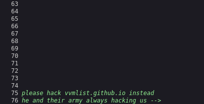

---

## Initial Access

### Step 1: Directory Enumeration

Performed comprehensive directory brute-forcing to identify hidden endpoints and exposed resources:

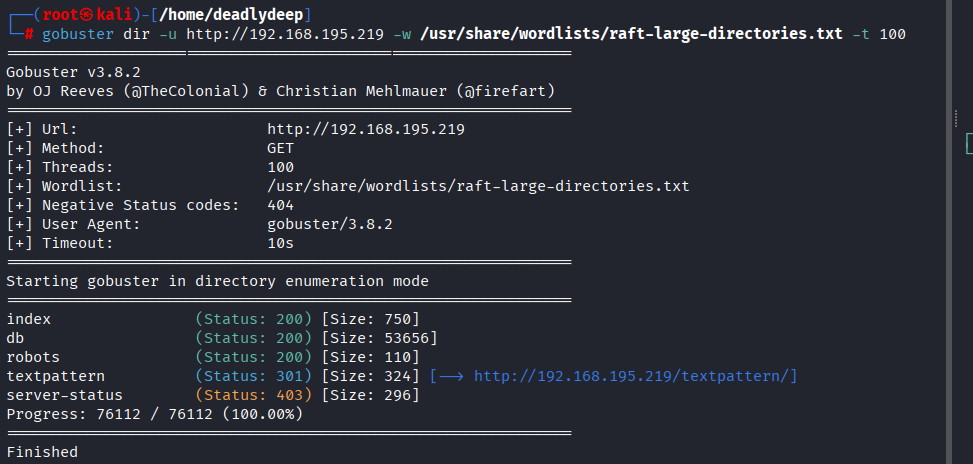

Got a hint on /robots directory


Attempted fuzzing with .zip file extension using multiple wordlists, which initially yielded no results:

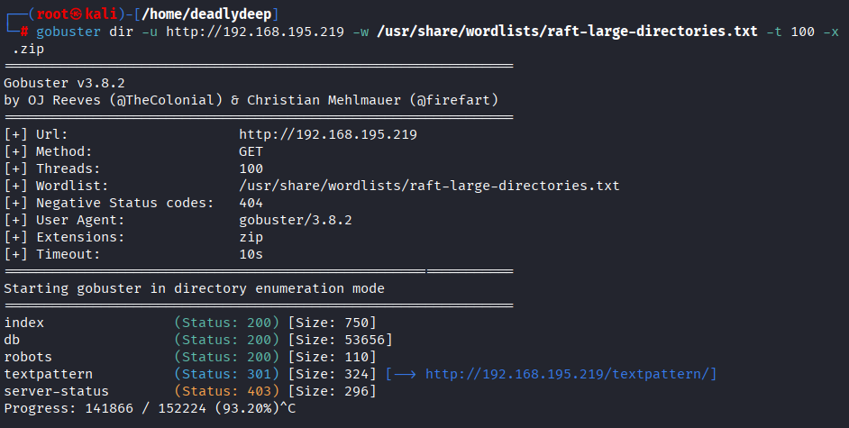

### Step 2: Application Discovery

Discovered the `/textpattern/textpattern` endpoint, revealing a TextPattern CMS installation:

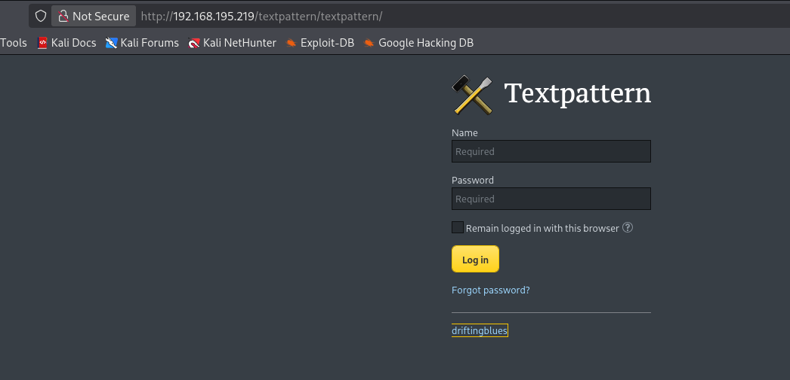

Performed additional directory fuzzing on this subdirectory to identify further endpoints:

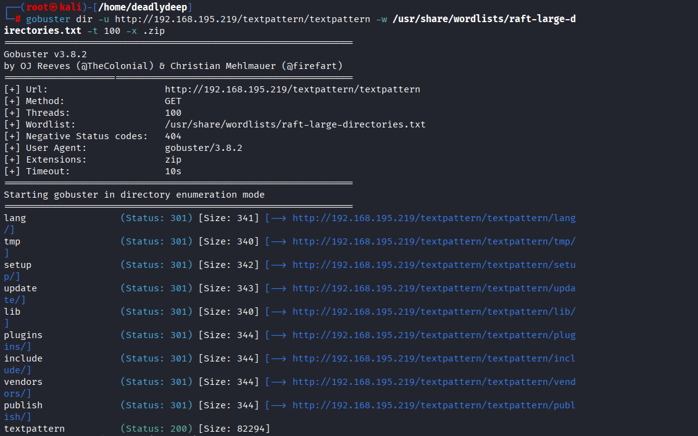

### Step 3: Setup and Configuration Discovery

The `/setup` endpoint revealed setup-related functionality:


### Step 4: Library and Additional Resources

Examined the `/lib` directory:

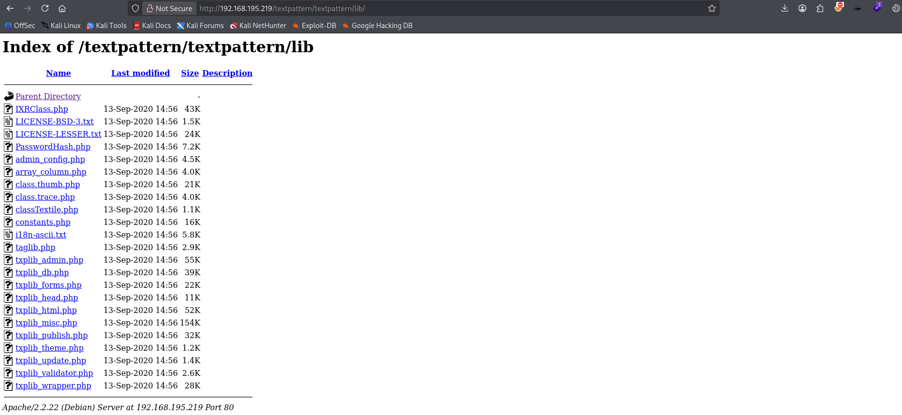

After testing multiple wordlists without significant results, continued enumeration led to discovery of a valuable file:


### Step 5: Archive Extraction and Credential Extraction

Downloaded the discovered ZIP file, which was protected with a password:


Used `rockyou.txt` wordlist to crack the ZIP file password:

```bash
fcrackzip -u -D -p rockyou.txt archive.zip
```

Successfully cracked the password and extracted the contents, revealing a credentials file:

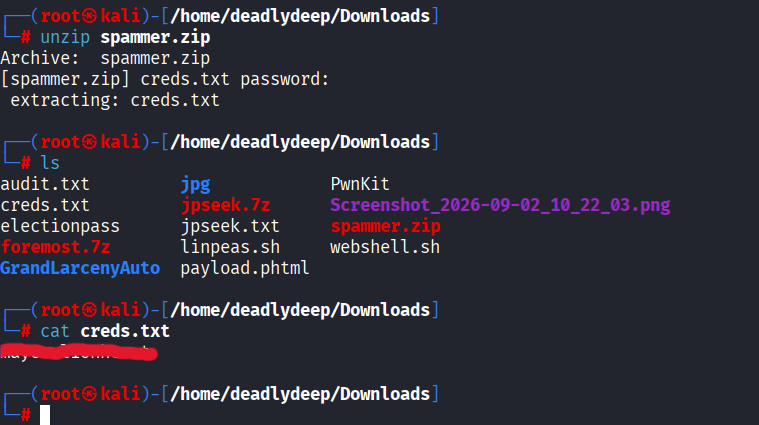

### Step 6: Authentication

Attempted the extracted credentials against the TextPattern CMS login page:

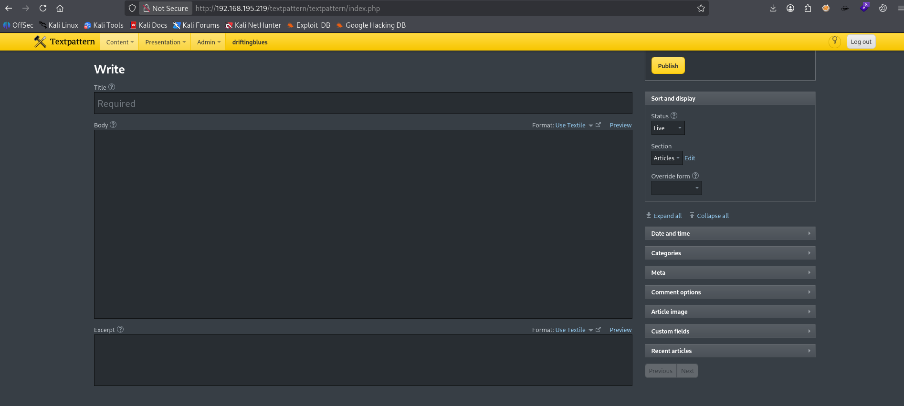

Credentials were valid! Successfully authenticated to the application.

### Step 7: File Upload Vulnerability

Discovered a file upload functionality within the authenticated panel:

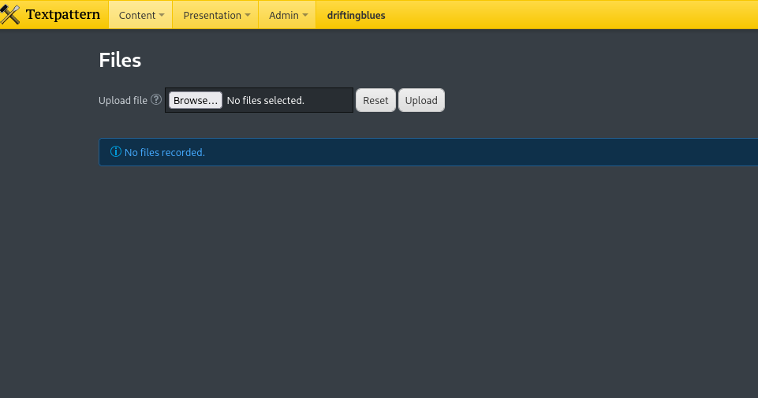

### Step 8: Web Shell Deployment

Uploaded a PHP reverse shell (using PentestMonkey's template) to establish remote code execution:


Set up a Netcat listener on the attacking machine:


Navigated to the uploaded file and executed the PHP shell:

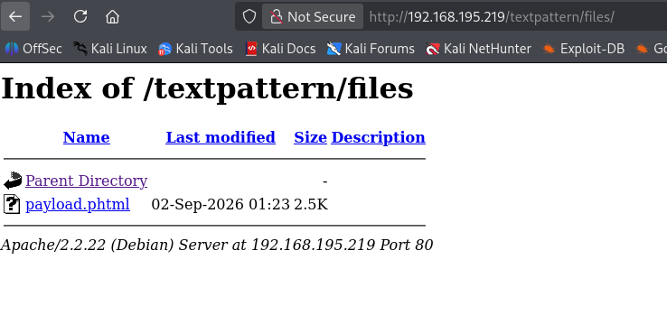

Successfully obtained a reverse shell connection:

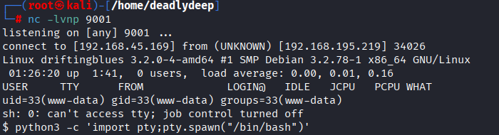

---

## Privilege Escalation

### Step 1: Shell Stabilization

Stabilized the shell for better usability and command execution:

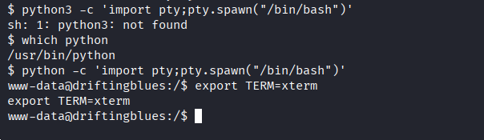

### Step 2: Privilege Escalation Reconnaissance

Attempted to locate the user flag (`local.txt`), but it was not accessible with current permissions. Checked for privilege escalation vectors:

- Verified sudo availability: None configured
- Analyzed SUID binaries: No useful exploits available
- Examined kernel version for known vulnerabilities:

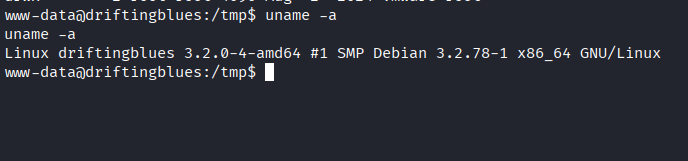

### Step 3: DirtyCow Vulnerability Identification

Researched the kernel version and discovered it was vulnerable to CVE-2016-5195 (DirtyCow):


The identified kernel version was vulnerable to the DirtyCow privilege escalation exploit.

### Step 4: Exploit Transfer and Compilation

Downloaded the DirtyCow exploit source code from an exploit repository:

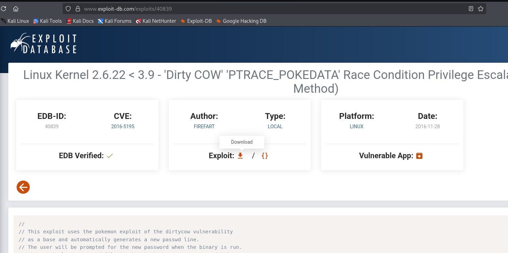

Set up a Python HTTP server on the attacking machine (using tun0 interface) to transfer the exploit:


Downloaded and compiled the exploit on the target system:


### Step 5: Exploit Execution

Executed the compiled DirtyCow exploit. The tool prompted for a new password to set for the root account:

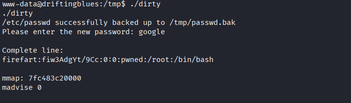

Switched to the root user using the newly set password:


### Step 6: Flag Capture

Successfully retrieved the system flag with elevated privileges:

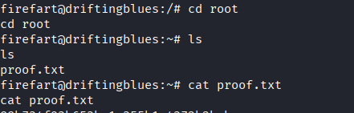

---

## Conclusion

The Drifting Blue 6 lab was successfully compromised through the following attack chain:

1. **Enumeration** - Systematic web application scanning revealed hidden endpoints and resources
2. **Credential Extraction** - Password-protected archives were successfully cracked using common wordlists
3. **Authentication Bypass** - Valid credentials were obtained and used for application access
4. **Remote Code Execution** - File upload vulnerability was exploited to deploy and execute a web shell
5. **Privilege Escalation** - Kernel vulnerability (DirtyCow/CVE-2016-5195) was leveraged to gain root access
6. **Flag Retrieval** - System flag was captured with root privileges

### Key Takeaways

- **Directory enumeration** is critical for discovering hidden applications and resources
- **Password-protected assets** should be properly secured; common wordlists remain effective
- **File upload functionality** requires strict validation and execution prevention
- **Kernel patching** is essential; outdated kernels present significant security risks
- **Principle of least privilege** should be enforced throughout systems

---

*Writeup completed during OffSec Play Lab assessment*

**Author**: Security Researcher  
**Date**: 2024  
**Lab**: Drifting Blue 6 (OffSec Play)

---

## Resources

- [DirtyCow Vulnerability Details](https://dirtycow.ninja/)
- [TextPattern Security](https://textpattern.com/)
- [OWASP File Upload](https://owasp.org/www-community/attacks/Unrestricted_File_Upload)
