# Election 1 — OffSec Playground Write-up

> **Platform:** OffSec Proving Grounds Play  
> **Machine:** Election 1  
> **Focus:** Web enumeration → credential discovery → SSH access → Linux privilege escalation

---

## Overview

This write-up documents my enumeration and exploitation path through the **Election 1** lab.

The initial attack surface consisted of SSH and HTTP. Web enumeration revealed the Election application, exposed directories, and eventually system logs containing credentials. Those credentials provided SSH access and the user flag.

For privilege escalation, enumeration uncovered a **SUID `serv-u` binary**. Searching for a matching public exploit led to a local privilege-escalation path that resulted in root access and the root flag.

The original notes also document alternative routes involving **phpMyAdmin default credentials** and **PwnKit**.

> **Lab-only note:** The techniques and commands documented here are intended for authorized training environments such as OffSec Proving Grounds Play.

---

## Attack Path

```text
┌──────────────────────┐
│  Initial Enumeration │
│   SSH :22 / HTTP :80 │
└──────────┬───────────┘
           │
           ▼
┌──────────────────────┐
│   Web Enumeration    │
│ robots.txt           │
│ /phpmyadmin          │
│ /election            │
└──────────┬───────────┘
           │
           ▼
┌──────────────────────┐
│ Recursive Enumeration│
│ /admin/logs          │
└──────────┬───────────┘
           │
           ▼
┌──────────────────────┐
│ Credential Discovery │
└──────────┬───────────┘
           │
           ▼
┌──────────────────────┐
│      SSH Access      │
│     local.txt        │
└──────────┬───────────┘
           │
           ▼
┌──────────────────────┐
│ Privilege Escalation │
│ SUID → serv-u exploit│
└──────────┬───────────┘
           │
           ▼
┌──────────────────────┐
│        ROOT          │
│      proof.txt       │
└──────────────────────┘
```

---

# 1. Initial Enumeration

I started with an Nmap scan against the target.

The scan identified two open ports:

- **22/tcp — SSH**
- **80/tcp — HTTP**

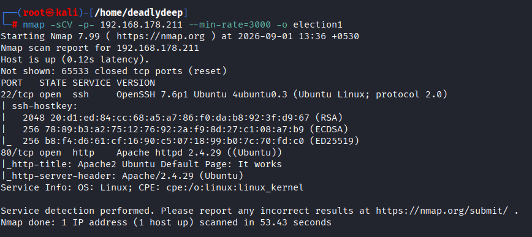

The HTTP service was running a standard Apache web server page.

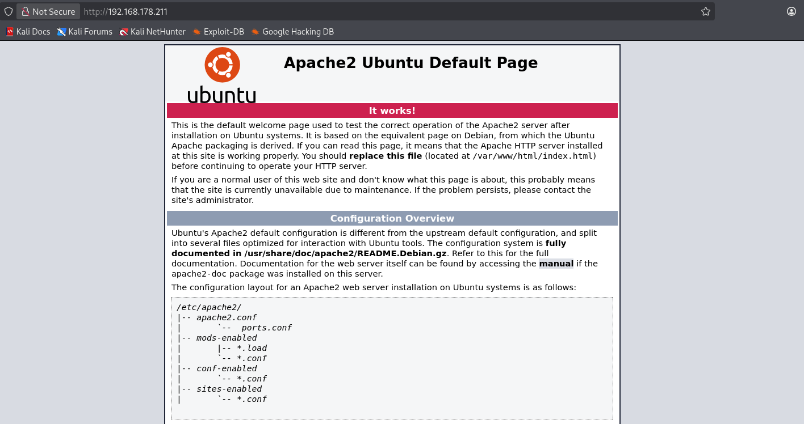

---

# 2. Web Enumeration

With HTTP exposed, I moved on to directory enumeration using **Gobuster**.

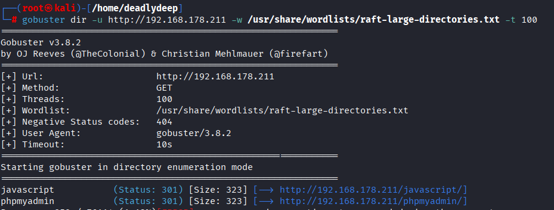

The discovered paths provided several places to investigate. I also manually checked `robots.txt`, which contained a useful hint.

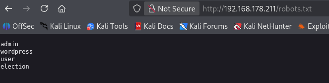

I then performed another scan using the information obtained during the first round of enumeration.

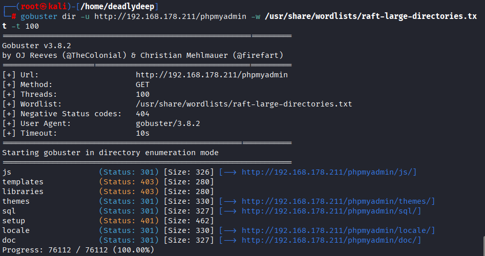

---

# 3. phpMyAdmin

One of the discovered paths was `/phpmyadmin`.

Visiting it returned a standard phpMyAdmin login page.

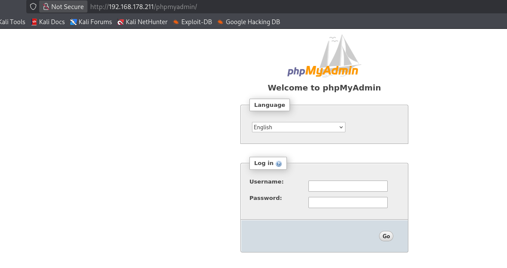

I checked the directories exposed around the phpMyAdmin installation as well.

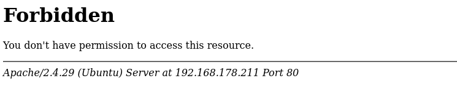

---

# 4. The Election Application

While continuing enumeration, I visited `/election`.

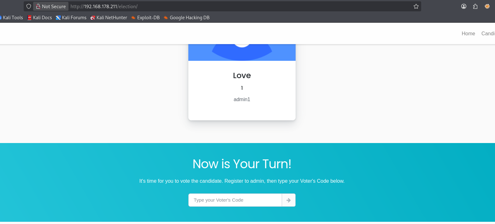

The application exposed a candidate/user named **Love**, which appeared to be a potentially valid account.


I continued directory fuzzing against the Election application itself.

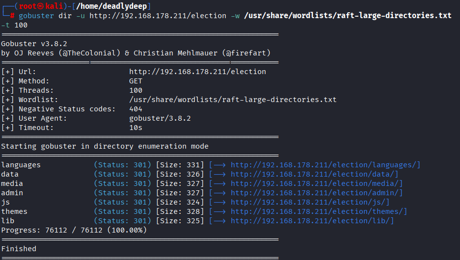

The `/data` directory looked interesting but did not contain anything useful. `/media` was accessible and exposed its contents.

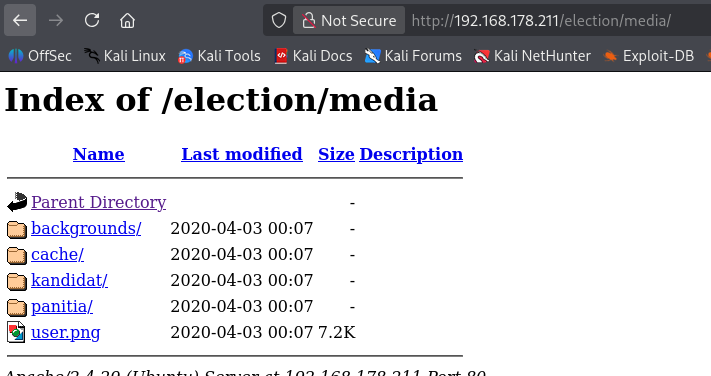

That did not immediately provide a useful path, so I moved on to `/admin`.

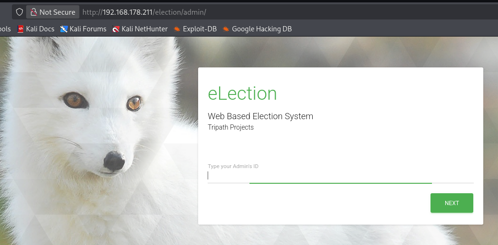

This revealed an administrative login page. At this point I did not have the required credentials.

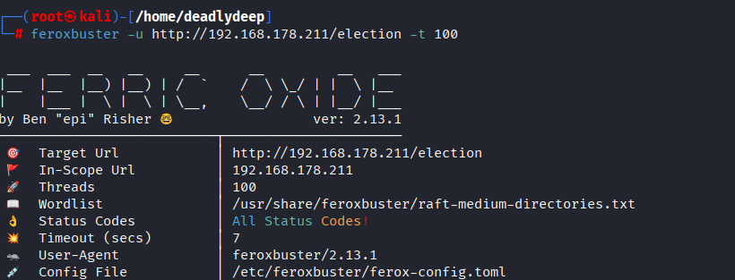

Since the first round of enumeration had not exposed the credentials directly, I switched to **recursive directory enumeration with Feroxbuster**.

---

# 5. Recursive Enumeration → Logs

The recursive scan uncovered a `log` directory.

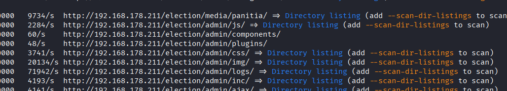

I inspected the directory.

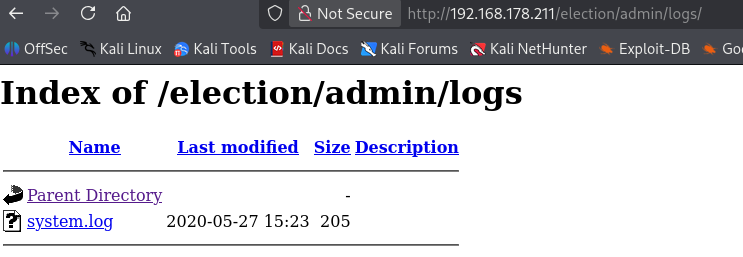

The logs contained credentials for a user.

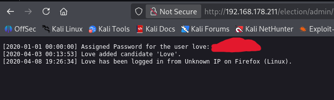

This was the turning point of the enumeration phase.

---

# 6. SSH Access

Using the recovered credentials, I attempted an SSH login.

The credentials worked.

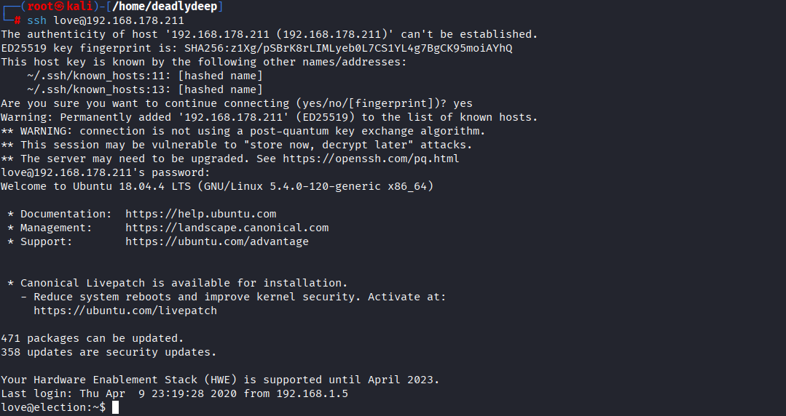

Once logged in, I retrieved the user flag:

```text
local.txt
```

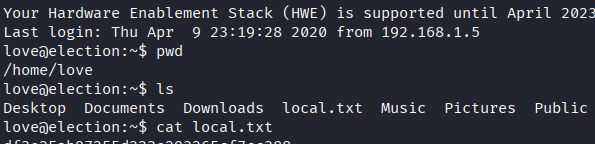

---

# 7. Privilege Escalation Enumeration

With a shell as the low-privileged user, I started checking the usual privilege-escalation avenues.

I first checked for commands that could be executed through `sudo` without requiring a password. Nothing useful was found.

I also checked for interesting SUID binaries, but the initial check did not immediately reveal the escalation path.

I then transferred **LinPEAS** from the attacker machine to the target using SCP.

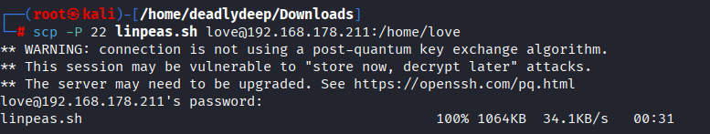

I made the script executable and ran it.

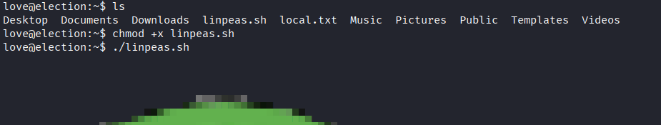

LinPEAS produced several interesting findings.

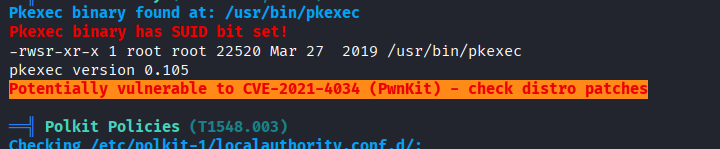

---

# 8. SUID `serv-u`

After reviewing the LinPEAS output, I revisited the SUID binaries manually.

This time, an interesting binary stood out:

```text
/usr/local/Serv-U/Serv-U
```

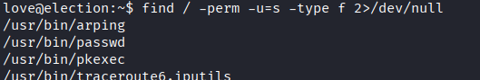

The binary was running with the SUID bit set, making it worth investigating as a potential privilege-escalation vector.

I searched for a corresponding exploit using **SearchSploit**.

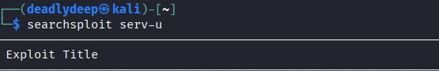

SearchSploit returned a **Serv-U local privilege escalation** exploit.

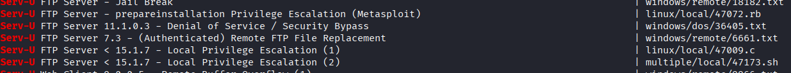

---

# 9. Exploiting Serv-U

I copied the relevant exploit into my working directory and transferred it to the target using SCP.

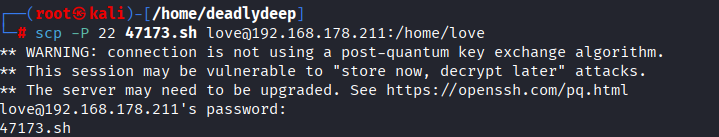

After transferring the exploit, I gave it execute permission and ran it.

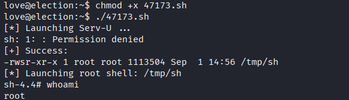

The exploit successfully resulted in root access.

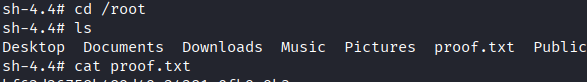

I then verified access to the root-owned filesystem and retrieved the root flag:

```text
proof.txt
```

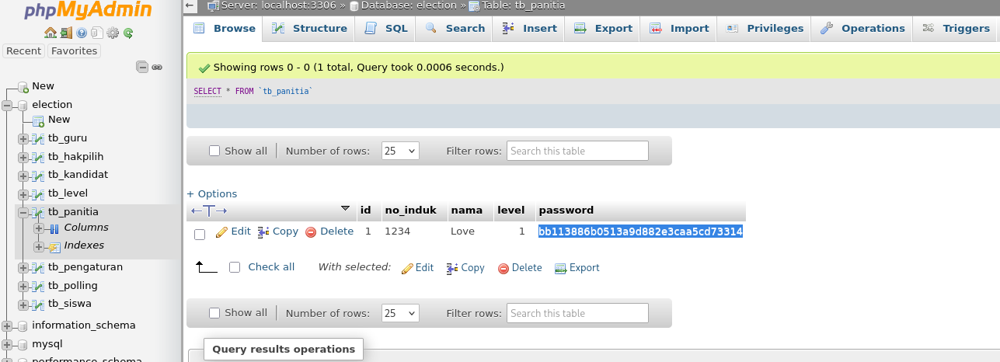

---

# 10. Alternative Path — phpMyAdmin

The original notes also document another route through the web application.

The phpMyAdmin installation was still using default credentials. Logging into phpMyAdmin exposed credentials associated with the Election application.

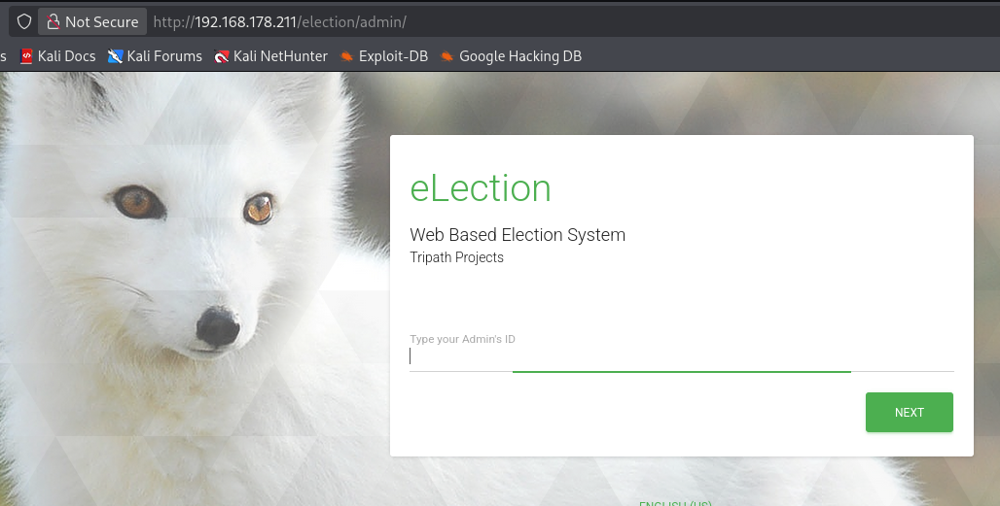

The Election application's password was stored as a hash.

The original write-up notes that the hash could be cracked using an online cracking service, after which the recovered credentials could be used to log into the Election application.

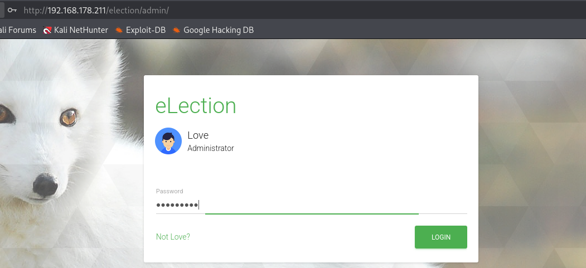

This provides an alternative way to reach the application credentials without relying on the same recursive enumeration path.

---

# 11. Alternative Enumeration — Direct Logs

The logs discovered during recursive enumeration were also accessible directly through the web application.

Navigating to the relevant location exposes the same system logs found during directory enumeration.

This means the recursive Feroxbuster scan can be avoided if the location is already known.

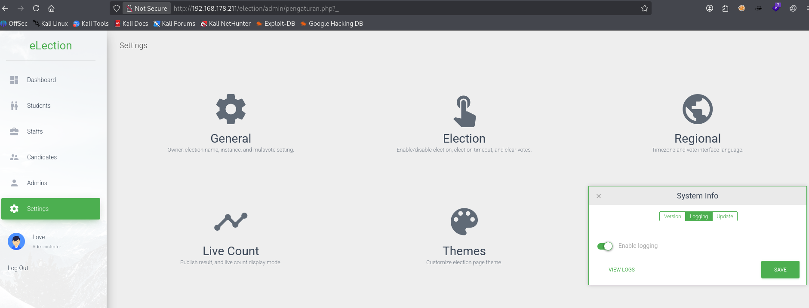

---

# 12. Alternative Privilege Escalation — PwnKit

The original notes also identify the machine as vulnerable to **PwnKit**.

The documented approach was to transfer a PwnKit exploit to the target, make it executable, and run it to obtain root privileges.

This is a separate privilege-escalation path from the SUID `serv-u` route described above.

---

# 13. Flags

| Flag | Result |
|---|---|
| User | `local.txt` |
| Root | `proof.txt` |

---

# 14. Key Takeaways

### Enumeration matters

The initial web server did not immediately expose the full attack path. Multiple rounds of enumeration were required.

### Don't stop after the first SUID check

The useful SUID binary was discovered after revisiting the SUID enumeration. Re-checking findings with a different tool or manually can expose things that are easy to overlook.

### Logs can be valuable

The exposed logs contained credentials that directly enabled SSH access.

### Look for multiple attack paths

This machine offered more than one route:

- Credential discovery through exposed logs
- phpMyAdmin default credentials
- SUID `serv-u` privilege escalation
- PwnKit privilege escalation

---

## Methodology Summary

```text
Nmap
  │
  ├── 22/tcp SSH
  └── 80/tcp HTTP
          │
          ▼
      Gobuster
          │
          ├── /robots.txt
          ├── /phpmyadmin
          └── /election
                    │
                    ▼
               Feroxbuster
                    │
                    ▼
                /admin/logs
                    │
                    ▼
             Credential leak
                    │
                    ▼
                  SSH
                    │
                    ▼
               local.txt
                    │
                    ▼
               SUID enum
                    │
                    ▼
                 serv-u
                    │
                    ▼
             SearchSploit
                    │
                    ▼
              Local exploit
                    │
                    ▼
                   root
                    │
                    ▼
                proof.txt
```

---

## Disclaimer

This write-up is for educational purposes and documents exploitation of an intentionally vulnerable **OffSec Proving Grounds Play** lab machine. Do not apply these techniques to systems you do not own or have explicit authorization to test.

---

**Author:** DeadlyDeep  
**Platform:** OffSec Proving Grounds Play  
**Machine:** Election 1
