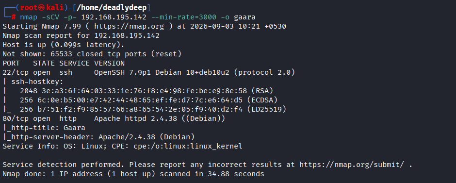
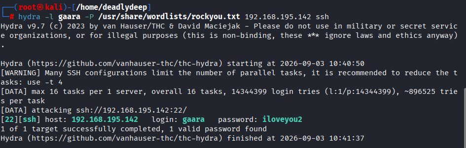
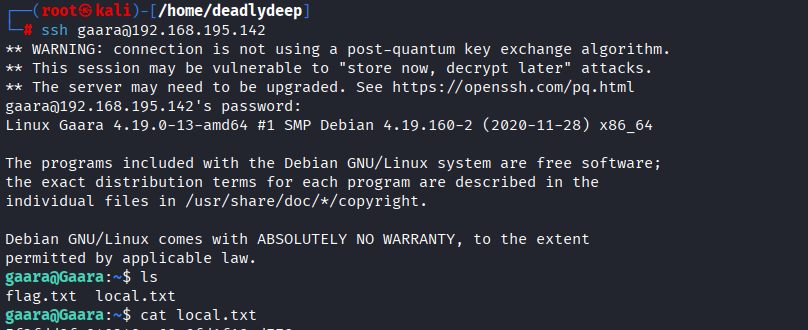
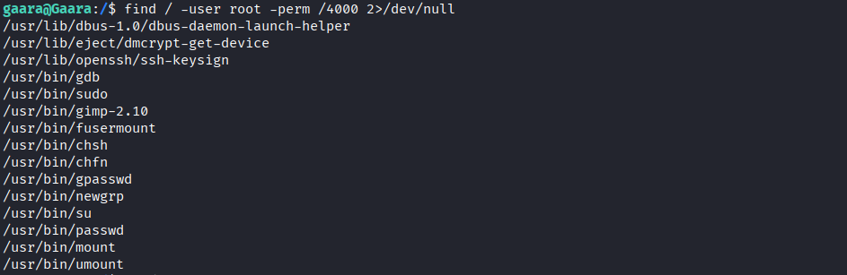
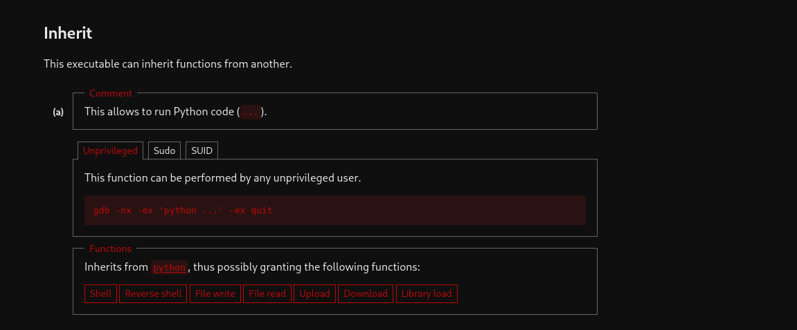
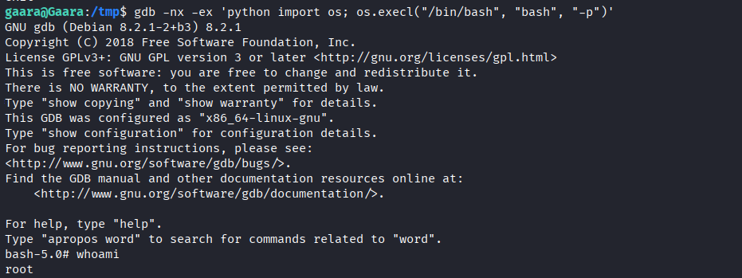
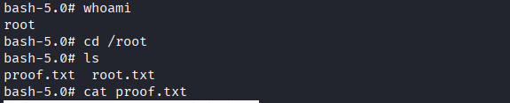

# Gaara - OffSec Play Lab Writeup

## Challenge Overview

A complete walkthrough of the Gaara challenge from OffSec Play Lab, covering reconnaissance, exploitation, and privilege escalation techniques.

---

## Table of Contents

1. [Reconnaissance](#reconnaissance)
2. [Exploitation](#exploitation)
3. [Privilege Escalation](#privilege-escalation)
4. [Flag Capture](#flag-capture)

---

## Reconnaissance

### Initial Network Scan

Starting with a comprehensive Nmap scan to identify open ports and services:

*Nmap scan results showing available services on the target*

### Web Service Discovery

Accessed the web application running on the target:

*The target website interface*

### Directory and Service Enumeration

Performed extensive directory fuzzing using multiple wordlists to identify hidden paths and endpoints. While standard directory brute-forcing yielded no additional results, further reconnaissance revealed SSH service availability.

---

## Exploitation

### SSH Brute Force Attack

Attempted SSH enumeration against the `gaara` username:

*SSH brute force results*

### User Flag Acquisition

Successfully gained initial access to the system:

*User flag captured from the compromised account*

---

## Privilege Escalation

### Sudo Privileges Investigation

First, checked for user-level sudo privileges that could be executed without a password:

*No additional sudo privileges available for direct exploitation*

### SUID Binary Analysis

Enumerated SUID (Set User ID) binaries available on the system:

*SUID binaries found on the target system*

### GDB Exploitation

Identified that `/usr/bin/gdb` (GNU Debugger) was available with SUID privileges. Consulted GTFOBins for potential exploitation vectors:

*GTFOBins showing GDB privilege escalation technique*

### Root Access Achieved

Executed the GDB-based Python command injection:

*Successful privilege escalation to root user*

---

## Flag Capture

Both user and root flags were successfully captured during the compromise:

- **User Flag**: Retrieved after SSH brute force attack
- **Root Flag**: Obtained after GDB-based privilege escalation

---

## Key Takeaways

1. **SSH Enumeration**: Weak credentials or password reuse can be exploited through brute force attacks
2. **SUID Binary Audit**: Always audit SUID binaries as they represent potential privilege escalation vectors
3. **GTFOBins Reference**: Tools like GTFOBins provide quick lookup for known exploitation techniques
4. **Principle of Least Privilege**: Restricting SUID binaries significantly reduces attack surface

---

## Tools Used

- **Nmap**: Network reconnaissance and port scanning
- **Hydra/Custom Script**: SSH brute force attack
- **GDB**: Debugger and privilege escalation vector
- **GTFOBins**: Exploitation technique reference

---

## Disclaimer

This writeup is for educational and authorized testing purposes only. Always obtain proper authorization before conducting security assessments.

---

*Challenge: Gaara | Platform: OffSec Play Lab*
