# Pickle Rick — TryHackMe Writeup

A walkthrough for the **Pickle Rick** room on TryHackMe — a beginner-friendly
Rick and Morty themed CTF that covers web enumeration, a PHP login panel,
a web shell, and privilege escalation via `sudo`.

**Goal:** find all three of Rick's secret ingredients hidden across the
file system.

---

## Recon

Started with an `nmap` scan against the target to see what's open.

```
nmap -sCV -p- 10.48.177.128 --min-rate=3000 -o picklerick
```

- **22/tcp** — OpenSSH 8.2p1 (Ubuntu)
- **80/tcp** — Apache httpd 2.4.41, page title *"Rick is sup4r cool"*

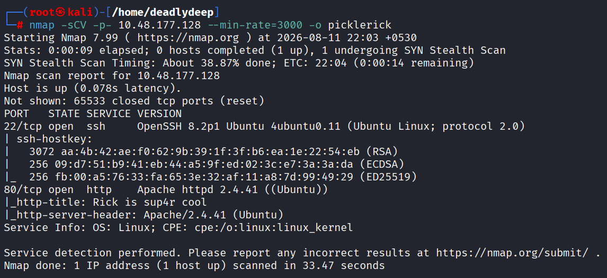

## Web Enumeration

Checked the page source of the website and found a username hidden there.

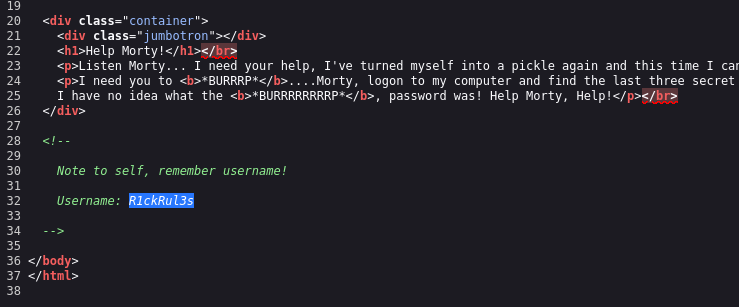

Ran `feroxbuster`, which came up empty. Followed up with `gobuster` using
`common.txt`, which turned up `robots.txt`.

`robots.txt` contained a password.

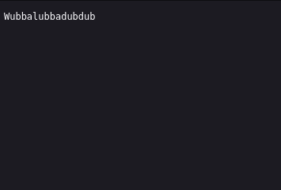

Tried the credentials against SSH first — no luck.

Continued manual directory fuzzing and found `login.php`.


## Gaining a Foothold

The credentials worked on `login.php`, logging into a panel that exposed a
web shell.

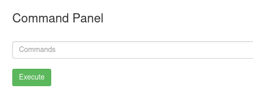

Checked the page source of the shell panel and found a base64-encoded
string. Tried decoding it (including nested decoding), but this turned out
to be a rabbit hole — no useful data.

Ran `whoami` through the web shell — running as `www-data`.

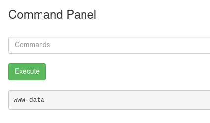

Ran `pwd` — landed in `/var/www/html`.

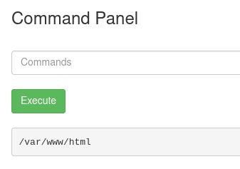

Listed the directory and found several files, including `clue.txt` and
`Sup3rS3cretPickl3Ingred.txt`.

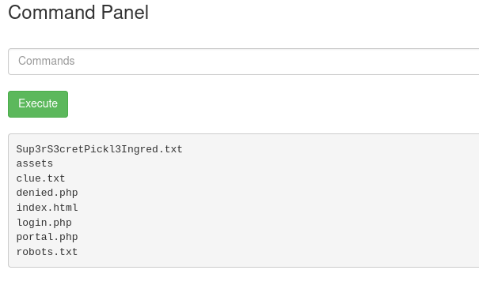

The web shell's `ls` command didn't return output properly, so I used
`less` to read files instead:

- `clue.txt` — hinted to look elsewhere on the file system for the next ingredient.
- `Sup3rS3cretPickl3Ingred.txt` — contained **Ingredient #1**.

## Upgrading to a Reverse Shell

Checked whether Python3 was available on the target with `which python3` —
it was.

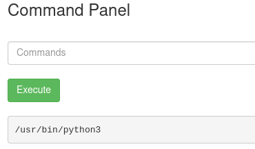

Set up a `netcat` listener on my machine to catch the reverse shell.

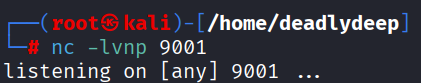

Tried the classic pentestmonkey PHP reverse shell first — it failed to
connect. Switched to the shortest Python3 reverse shell from
[revshells.com](https://www.revshells.com/), which worked.

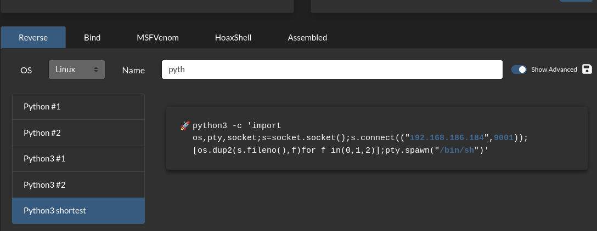

Caught the shell on the listener.

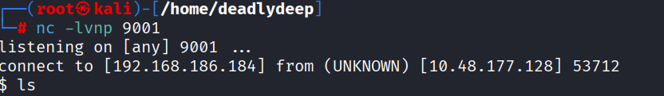

## Privilege Escalation

From the shell, navigated to `/home` and found two users: `rick` and
`ubuntu`. Moved into `rick`'s home directory and found a file named
`second ingredients`. Used `cat` to read it and obtained **Ingredient #2**.

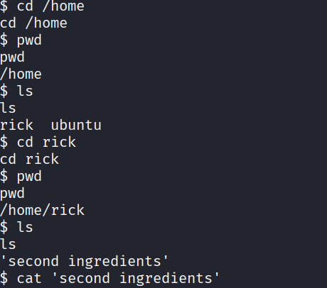

Checked sudo privileges with `sudo -l` — the `www-data` user could run **all**
commands with `sudo`, with no password required.

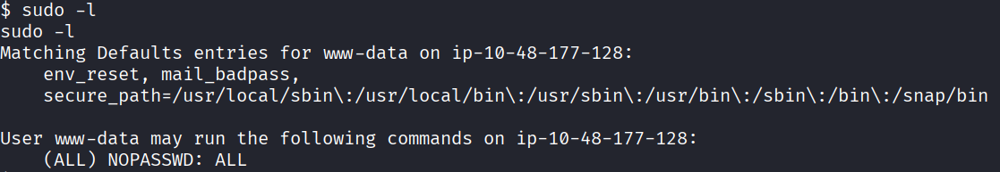

Moved to `/`, and tried `cd /root` directly — permission denied. Also tried
running `cd` through `sudo`, but `cd` isn't a standalone binary so that
failed too. Stabilized the shell to make further interaction easier.

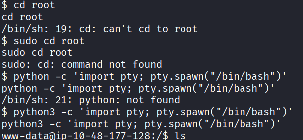

Instead of `cd`-ing into `/root`, used `sudo ls /root` to list its contents
directly, which revealed `3rd.txt`. Read it with:

```
sudo cat /root/3rd.txt
```

This returned **Ingredient #3** — the final piece.

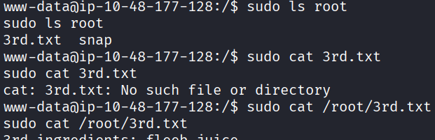

---

## Summary

| Stage | Technique |
|---|---|
| Recon | `nmap` full port scan |
| Enumeration | Page source review, `gobuster`/`feroxbuster`, `robots.txt` |
| Foothold | Credential reuse on `login.php` → built-in web shell |
| Shell upgrade | Python3 reverse shell via `revshells.com` |
| Privilege escalation | `sudo -l` → passwordless `sudo` for all commands |

All three of Rick's secret ingredients recovered. 🥒

Thanks for reading!
