# CorpWebsite - CTF Writeup

## Reconnaissance

### Port Scanning
Performed an Nmap scan which revealed two open ports:
- **SSH** - Standard secure shell access
- **Web Service** - Running on port 3000

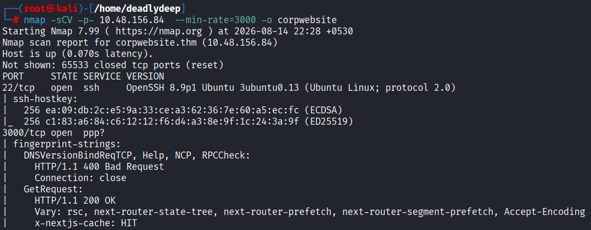

### Web Service Discovery
Accessed the webpage running on port 3000 using `http://$ip:3000`. The website appears to be a corporate webpage with standard content.

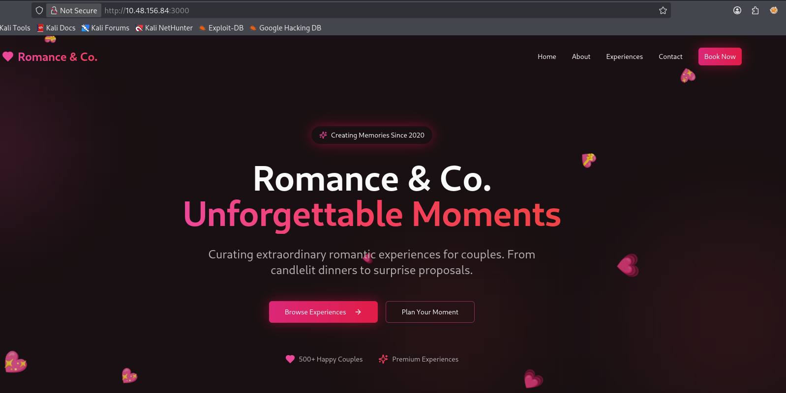

### Technology Enumeration
Attempted initial directory fuzzing using:
- `gobuster`
- `feroxbuster`

Both tools yielded no results, even with manual fuzzing attempts.

Used **Wappalyzer** to identify the technologies in use on the website and discovered a critical vulnerability.

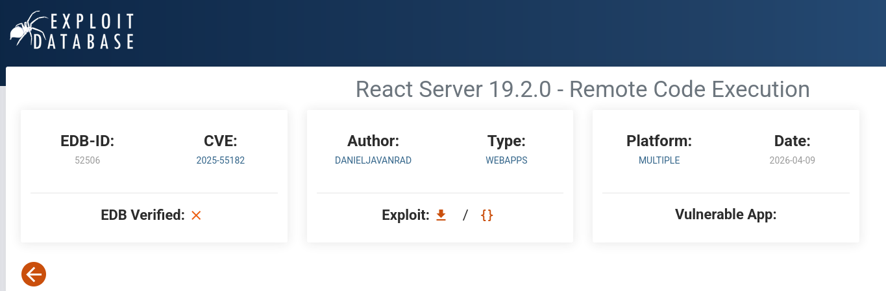

### Vulnerability Discovery
**Key Finding:** The website is running **Next.js version 16.0.6**, which is vulnerable to **Remote Code Execution (RCE)**.

**CVE:** CVE-2025-55182

Verified this vulnerability on ExploitDB to confirm exploit availability.

## Exploitation

### Metasploit Setup
Launched Metasploit and searched for the Next.js RCE exploit.

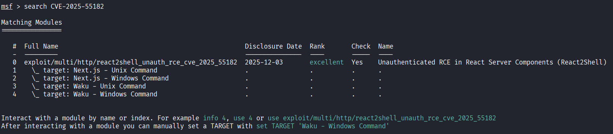

Found the appropriate exploit module:

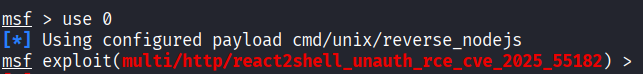

### Configuring the Exploit
Checked the exploit options using the `show options` command:

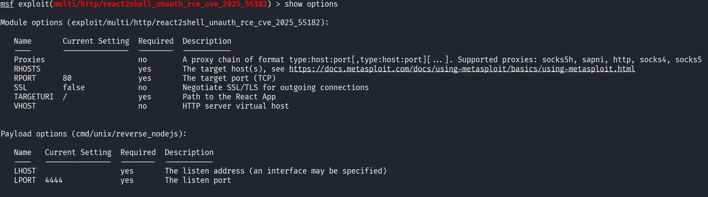

Required parameters to configure:
- **RHOSTS** - Target IP address
- **RPORT** - Port 3000
- **TARGETURI** - `http://$ip:3000`
- **LHOST** - Your VPN IP address
- **LPORT** - Already pre-configured

After setting the required options:

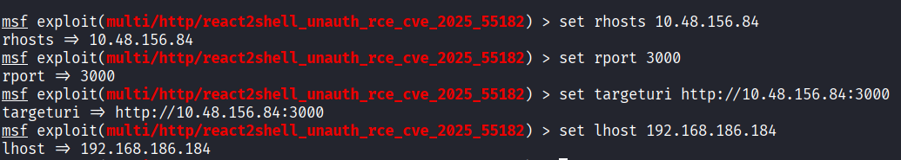

Final options verification:

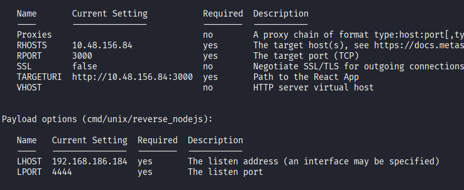

### Running the Exploit
Executed the exploit using the `run` command:

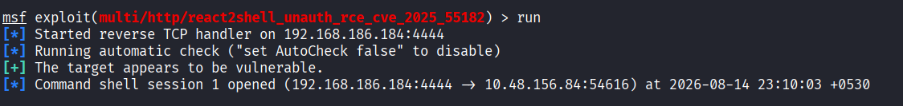

**Success!** Achieved remote code execution and gained a shell on the target system.

## Post-Exploitation

### User Enumeration
Performed enumeration to identify the current user. Discovered we are running as a user named **daniel**.

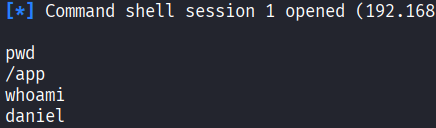

### Finding User Flag
Attempted shell stabilization but encountered issues, so continued with the unstable shell. Navigated to the `/home/daniel` directory and located the user flag.

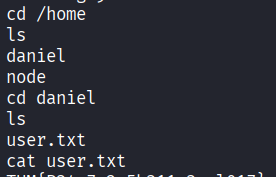

## Privilege Escalation

### Sudo Privileges Check
Checked what sudo commands the `daniel` user can execute:

```bash
sudo -l
```

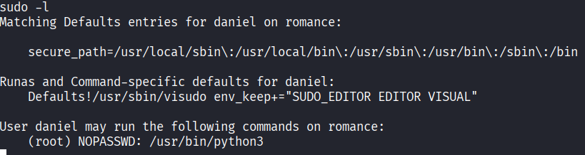

**Key Finding:** The `daniel` user can run **python3** as root **without requiring a password**.

### Exploiting Python3 Privilege
Used Python 3 to spawn a root shell:

```bash
sudo python3 -c 'import os; os.system("/bin/bash")'
```

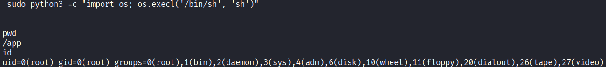

Successfully obtained root access!

### Root Flag
Changed directory to `/root` and retrieved the root flag:

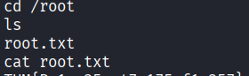

## Summary

This CTF demonstrated several important security concepts:

1. **Vulnerability in Framework Versions** - Next.js 16.0.6 contained a critical RCE vulnerability
2. **Technology Fingerprinting** - Using tools like Wappalyzer to identify software versions
3. **Unrestricted Sudo Privileges** - Allowing Python execution as root is extremely dangerous
4. **Weak Privilege Management** - No password requirement for sudo commands
5. **Lack of Input Validation** - The RCE vulnerability stemmed from improper input handling

**Key Tools Used:**
- `nmap` - Port scanning and service discovery
- `gobuster` / `feroxbuster` - Directory enumeration
- `wappalyzer` - Technology fingerprinting
- `metasploit` - Exploit framework and RCE delivery
- `sudo` - Privilege escalation analysis
- `python3` - Privilege escalation vector

**Exploited Vulnerabilities:**
- CVE-2025-55182 (Next.js RCE)
- Unrestricted Python execution via sudo

---

*Challenge completed successfully with both user and root flags captured.*
