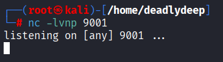

# Mr. Robot - CTF Writeup

## About the Challenge

**Mr. Robot** is a popular CTF (Capture The Flag) challenge inspired by the TV series of the same name. The challenge consists of finding three hidden flags scattered throughout a compromised website. The difficulty escalates through multiple stages requiring reconnaissance, web exploitation, privilege escalation, and hash cracking.

The challenge simulates a real penetration test scenario with multiple exploitation paths and intentionally misleading content (rabbit holes) to make the experience more challenging and authentic. All three flags must be captured in sequence: `key-1-of-3.txt`, `key-2-of-3.txt`, and `key-3-of-3.txt`.

---

## Reconnaissance

### Port Scanning
Performed an Nmap scan to identify open ports and services on the target machine.



Identified the following open services:
- **SSH** - Port 22
- **HTTP** - Port 80 (Main web service)

### Web Service Discovery
Accessed the web service on port 80. The homepage is designed like a terminal interface with several interactive commands available:


The webpage features the following commands:
- **Prepare** - Shows a video related to the Mr. Robot show
- **Fsociety** - Displays another show-related video
- **Inform** - Shows images and dialogues from the Mr. Robot series
- **Question** - Displays random images
- **Wakeup** - Plays another video from the show
- **Join** - Prompts for email address input (intentional rabbit hole)

The webpage is purely for immersion and atmosphere, designed to match the Mr. Robot theme without containing exploitable functionality.

### Page Source Analysis
Examined the HTML page source to identify any hardcoded credentials, comments, or useful information.


Result: The page source contained only an empty comment, with no useful information for exploitation.

### Directory Enumeration
Performed aggressive directory fuzzing using **gobuster** to discover hidden directories and files that might contain sensitive information.


Successfully discovered several interesting directories that proved valuable for the challenge progression.

## Exploitation Phase 1: Information Gathering

### robots.txt Discovery
Checked the standard `robots.txt` file which is commonly used to disallow sensitive paths. This is a good enumeration target.


**Key Finding:** The robots.txt file revealed:
- `wp-login.php`
- `wp-admin/` directory

These hints indicated a WordPress installation on the server.

### Downloading Sensitive Files
Used **wget** to download files that appeared in the robots.txt disallow list:

```bash
wget http://$ip/key-1-of-3.txt
wget http://$ip/fsocity.dic
```


**Success!** Retrieved the **first flag (Key-1-of-3.txt)** 🚩

**fsocity.dic** - A dictionary file containing a large list of potential passwords, approximately 858,160 lines. This is clearly intended for brute forcing WordPress login credentials.


### License Directory Analysis
Discovered the `/license` directory through directory fuzzing. Initially appeared to be a rabbit hole or intentionally misleading content.


After scrolling through the content, discovered a **Base64 encoded string** at the bottom, identified by the `=` padding character.


**Decoded the Base64** using an online decoder and obtained credentials:

```
Username: elliot
Password: [password from decode]
```


These credentials would prove essential for accessing the WordPress admin panel.

## Exploitation Phase 2: WordPress Access

### WordPress Login Page
Located the WordPress admin panel at the standard location: `http://$ip/wp-admin`


Attempted authentication using the credentials discovered in the license directory.

### Successful WordPress Authentication
Successfully logged in with the obtained credentials.


**User Privilege Level:** Editor (sufficient permissions to modify theme templates)

### Theme Editor Access
Navigated to the WordPress theme editor to inject malicious PHP code for remote code execution.


Located the **404.php** template file in the Twenty Fifteen theme directory.

### PHP Reverse Shell Injection
Replaced the legitimate 404.php template code with a **PHP Pentestmonkey reverse shell** from [revshells.com](http://revshells.com).

```php
<?php
// PHP reverse shell payload here
// Modified with attacker IP and port
?>
```


**Critical:** Remember to modify:
- **IP Address** - Set to your VPN IP address
- **PORT** - Set to an available port on your machine

Successfully updated and saved the malicious template file.

### Establishing Reverse Shell
Set up a **netcat listener** on the specified port to catch the incoming shell connection:

```bash
nc -lvnp [PORT]
```


Triggered the reverse shell by accessing the modified 404.php file in a web browser:

```
http://$ip/wp-content/themes/twentyfifteen/404.php
```


**Shell established successfully!** Connected as the **www-data** user with web server privileges.


### Shell Stabilization
Stabilized the shell using Python to obtain a fully interactive terminal with proper input/output handling:

```bash
python -c 'import pty; pty.spawn("/bin/bash")'
```


## Post-Exploitation Enumeration

### User and Directory Discovery
Navigated to the `/home` directory to identify system users and potential targets for lateral movement.


Found two important users:
- **robot** - The target user for next phase (has restricted permissions)
- **ubuntu** - Secondary user

### Credentials for Robot User
Changed to the `/home/robot` directory and discovered two critical files:

```bash
cd /home/robot
ls -la
```


**Files Found:**
1. **key-2-of-3.txt** - The second flag (currently permission denied)
2. **password.raw-md5** - Contains the MD5 hash of the robot user's password

### Extracting the Password Hash
Attempted to read the key file but received a permission denied error. Successfully retrieved the MD5 hash from the password file:

```bash
cat password.raw-md5
```


The hash was in a format suitable for cracking.

### Cracking the MD5 Hash
Used an online MD5 crack database ([hashes.com](http://hashes.com)) to reverse the hash and obtain the plaintext password:

```
MD5 Hash: [hash from file]
Plaintext Password: [cracked password]
```


## Privilege Escalation Phase 1: SSH Access

### SSH Authentication
Attempted to log in via SSH using the cracked robot user credentials:

```bash
ssh robot@$ip
```


Successfully authenticated and logged in as the **robot** user!

### Second Flag Retrieved
With elevated user privileges, was now able to read the second key file:

```bash
cat key-2-of-3.txt
```


**Obtained Key-2-of-3** ✅

## Privilege Escalation Phase 2: Root Access

### Sudo Privileges Analysis
Checked what commands the robot user can execute with sudo privileges:

```bash
sudo -l
```


Result: The robot user has **no sudo privileges** available. We must find another privilege escalation vector.

### SUID Binary Enumeration
Searched for files with the SUID (Set User ID) bit set, which could potentially be exploited for privilege escalation:

```bash
find / -perm -4000 2>/dev/null
```


**Critical Discovery:** The **nmap** binary has the SUID bit set!

This is highly unusual and exploitable. Standard Linux distributions do not grant SUID to nmap, making this an obvious privilege escalation vector.

### GTFObins - Nmap Research
Consulted GTFObins for nmap privilege escalation techniques and discovered an interactive mode exploit.


Found that older versions of nmap supported an interactive mode that could be exploited to execute arbitrary commands with root privileges.

### Executing Nmap Interactive Mode
Launched nmap in interactive mode and spawned a shell with root privileges:

```bash
nmap --interactive
nmap> !sh
```


The `!sh` command within nmap's interactive mode spawned a shell with root privileges!

### Root Access Achieved
Successfully escalated to root user. Now with root privileges, navigated to the `/root` directory to retrieve the final flag.

Due to directory access restrictions, used the `ls` command to list root directory contents:

```bash
ls -la /root
```

Confirmed the presence of the final key file.

### Third Flag Retrieved
Located and retrieved the third and final flag:

```bash
cat /root/key-3-of-3.txt
```

**Obtained Key-3-of-3** 🚩✅

---

## Summary

### Challenge Completed Successfully - All 3 Flags Captured! 🎉

```
✅ Key-1-of-3.txt - Found via robots.txt and directory enumeration
✅ Key-2-of-3.txt - Found after compromising robot user account
✅ Key-3-of-3.txt - Found after escalating to root privileges
```

### Vulnerability Chain & Exploitation Path

1. **Information Disclosure** - Hardcoded credentials in base64 within `/license` file
2. **Weak Credentials** - Dictionary-based password list available for brute force
3. **CMS Exploitation** - WordPress theme editor access with editor privileges allowed RCE
4. **Weak Credential Storage** - MD5 hashes used for password storage (easily reversible)
5. **Insecure SUID Permissions** - nmap binary with SUID bit set and interactive mode available
6. **Lack of Privilege Restrictions** - No additional protections on sensitive files

### Key Exploitation Techniques

- **robots.txt Analysis** - Identifying sensitive paths and hints
- **Directory Enumeration** - Finding hidden directories with valuable content
- **Base64 Decoding** - Extracting embedded credentials
- **WordPress Theme Injection** - Modifying templates for RCE
- **Reverse Shell Establishment** - Using PHP for remote code execution
- **MD5 Hash Cracking** - Reversing weak password hashes
- **Lateral Movement** - Moving from www-data → robot → root
- **SUID Exploitation** - Leveraging misconfigured nmap binary
- **Interactive Mode Abuse** - Using nmap's built-in shell spawning

### Tools Used

- **nmap** - Port scanning and service discovery
- **gobuster** - Directory and file enumeration
- **wget** - File downloading from web server
- **netcat** - Reverse shell listener and connection
- **ssh** - Secure shell access for lateral movement
- **python** - Shell stabilization and terminal interaction
- **hashes.com** - MD5 hash cracking and reversal
- **GTFObins** - SUID exploitation research and technique discovery

### Key Learnings

1. **Always check robots.txt** - Often contains hints about sensitive paths
2. **Base64 encoding is weak** - Not encryption, easily decoded
3. **CMS exploitation** - Theme/plugin editors with appropriate privileges can lead to RCE
4. **Hash strength matters** - MD5 is cryptographically broken and easily reversed
5. **SUID binaries are dangerous** - Non-standard SUID grants should be investigated
6. **Interactive modes** - Command interpreters with interactive modes may have escape capabilities
7. **Privilege separation** - Running services as low-privilege users limits damage scope
8. **Defense in depth** - Multiple security layers can prevent full compromise

### Attack Timeline

```
Reconnaissance
    ↓
Directory Enumeration → Found robots.txt and /license
    ↓
Credential Extraction → robots.txt + base64 decode
    ↓
WordPress Access → Theme editor RCE
    ↓
Reverse Shell → www-data shell
    ↓
Lateral Movement → Crack MD5 hash, SSH as robot
    ↓
Privilege Escalation → SUID nmap exploitation
    ↓
Root Access → Complete control achieved
    ↓
Flag Extraction → All 3 flags captured
```

### Defense Recommendations

1. **Secure Credentials** - Don't hardcode credentials in files or comments
2. **Use Strong Hashing** - Replace MD5 with bcrypt, Argon2, or PBKDF2
3. **Restrict File Permissions** - Set appropriate file ownership and permissions
4. **CMS Hardening** - Disable or protect theme/plugin editors
5. **SUID Review** - Regularly audit SUID binaries and remove unnecessary ones
6. **Input Validation** - Implement proper input validation in web applications
7. **Principle of Least Privilege** - Run services with minimal required permissions
8. **Update & Patch** - Keep all software and dependencies up to date

---

## Conclusion

The Mr. Robot CTF provides an excellent learning opportunity for understanding common web vulnerabilities, privilege escalation techniques, and the importance of proper security hardening. The challenge demonstrates how seemingly unrelated misconfigurations can be chained together to achieve complete system compromise.

The progression from reconnaissance through exploitation to full root access represents a realistic penetration test scenario where multiple vulnerabilities are leveraged to gain complete control of the target system.

**Challenge completed with all three keys captured. Well done!** 🎓

---

*This writeup demonstrates real-world penetration testing techniques and security concepts. Always practice responsible disclosure and ensure you have proper authorization before testing any systems.*
