# Root.me - CTF Writeup
[Visit CTF on tryhackme](https://tryhackme.com/room/rrootme)
## Reconnaissance

### Port Scanning
Performed an Nmap scan and identified two open ports: SSH and HTTP.

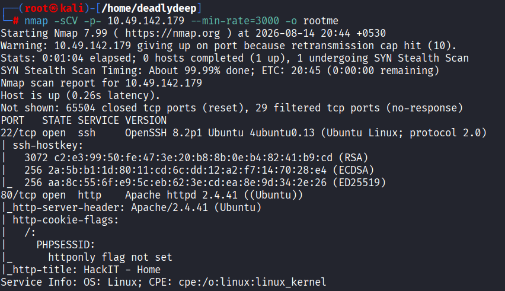

### DNS Configuration
Added the target URL address to the `/etc/hosts` file for proper DNS resolution.

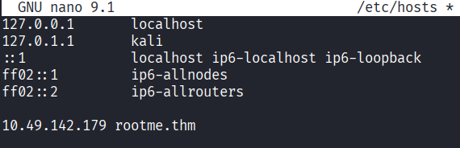

### Website Exploration
The website homepage looks fairly simple with minimal content.

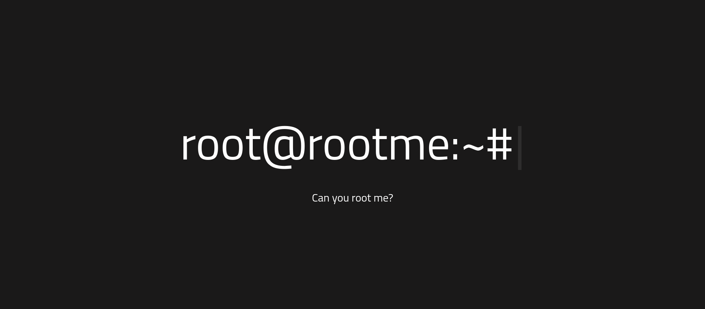

Checked the page source to look for any hidden clues, but it only contained an empty comment.

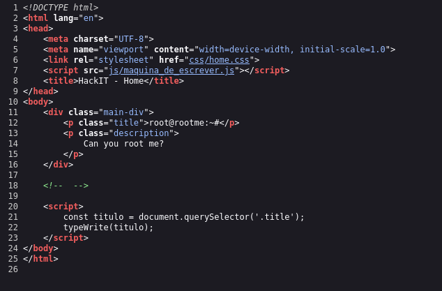

### Directory Fuzzing
Performed directory fuzzing using **gobuster** with the `common.txt` wordlist and discovered several directories.

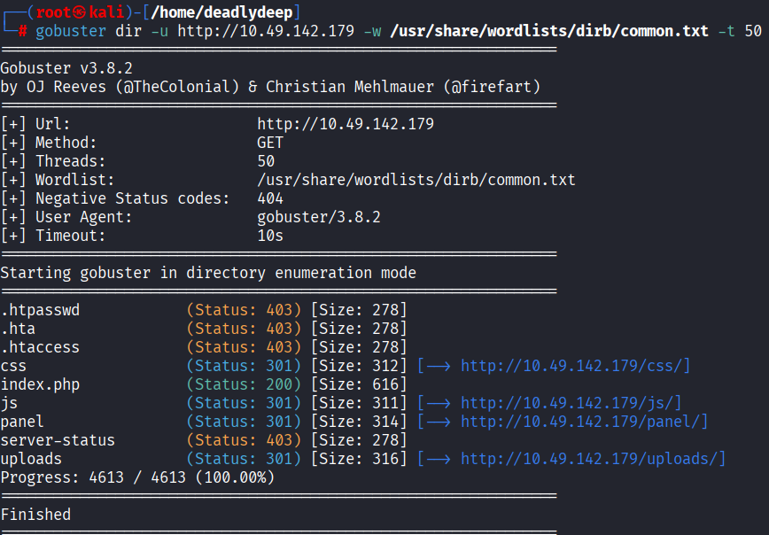

### File Upload Functionality
Discovered the `/panel` directory, which contained a file upload page.

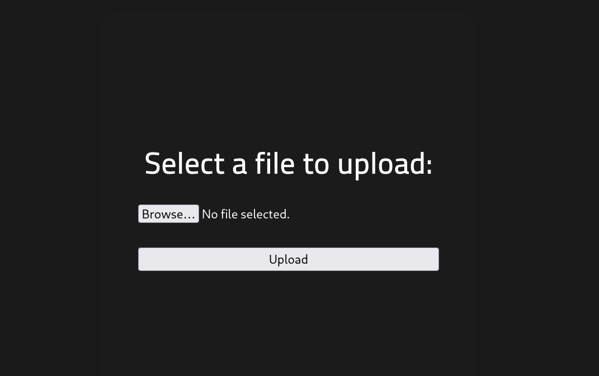

## Exploitation

### Initial Access - PHP Reverse Shell Upload
Attempted to upload a PHP reverse shell to gain remote code execution. I used PHP Pentestmonkey's reverse shell from [revshells.com](http://revshells.com).

**Important:** Remember to modify the IP and port in the payload to match your VPN IP and an available port on your machine.

The initial upload was named `payload.php`, but it failed due to extension filtering.

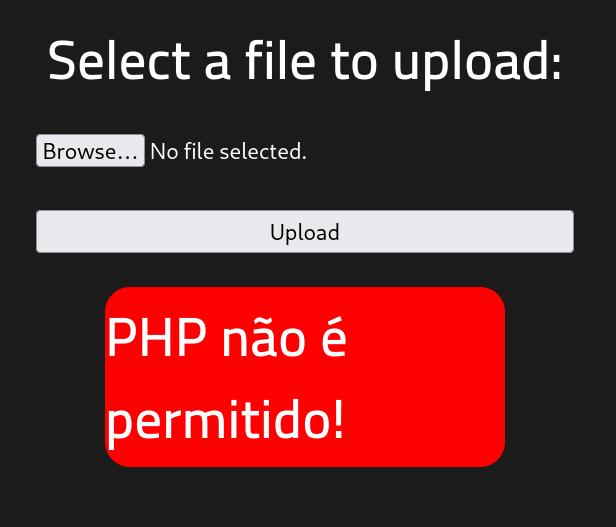

### Bypassing File Upload Restrictions
The website blocked `.php` file extensions. I bypassed this restriction by renaming the file to `.phtml` using the `mv` command.

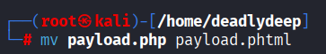

The file was successfully uploaded with the `.phtml` extension.

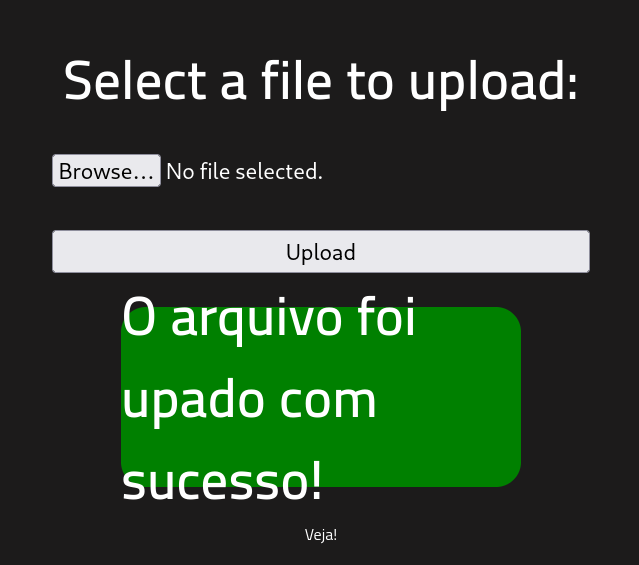

### Establishing Reverse Shell
Set up a netcat listener on the port specified in the reverse shell payload.

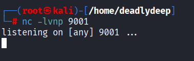

Accessed the uploaded shell by navigating to `http://$ip/uploads/payload.phtml`, which triggered the reverse shell connection.

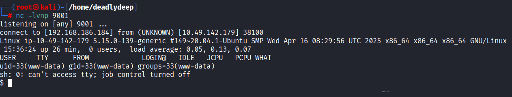

### Shell Stabilization
Stabilized the shell using Python to get a proper interactive terminal.

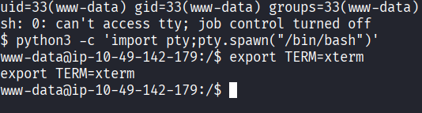

## Privilege Escalation

### Finding the User Flag
Changed to the `/home` directory, which is the most common location for user flags. Found three subdirectories (`/rootme`, `/test`, `/ubuntu`) but they were empty.

Used the `find` command to locate the `user.txt` file and successfully retrieved it.

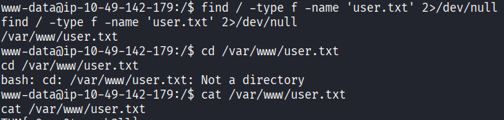

### SUID Binary Analysis
Checked for SUID binaries to find privilege escalation vectors.

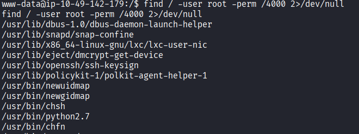

**Key Finding:** The `python2.7` binary has SUID permissions, which is unusual and exploitable.

### Exploitation via GTFObins
Searched GTFObins for Python 2.7 privilege escalation techniques and found an exploit.

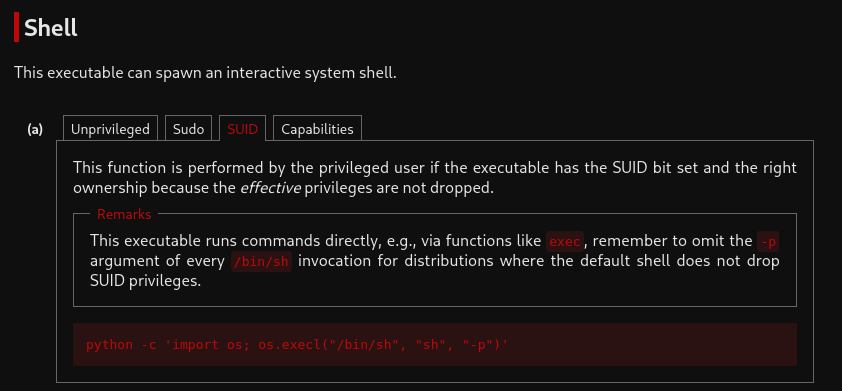

### Becoming Root
Executed the privilege escalation command in the shell:

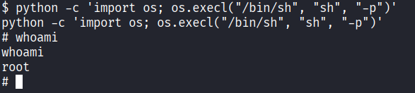

Successfully gained root access!

### Root Flag
Changed to the `/root` directory and retrieved the root flag from `root.txt`.

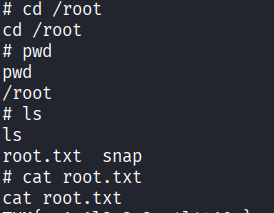

## Summary

This CTF demonstrated several common vulnerabilities:

1. **File Upload Vulnerabilities** - Simple extension-based filtering can be bypassed with alternative extensions (`.phtml`, `.phar`, etc.)
2. **Weak SUID Permissions** - Allowing high-level interpreters like Python to run with SUID is a major security risk
3. **Directory Enumeration** - Standard directory names made enumeration straightforward
4. **Lack of Input Validation** - No proper validation on uploaded files

**Key Tools Used:**
- `nmap` - Port scanning
- `gobuster` - Directory enumeration
- `netcat` - Reverse shell listener
- `python` - Shell stabilization and privilege escalation
- `find` - File search

**Exploited Vulnerabilities:**
- Unrestricted file upload with weak extension filtering
- SUID binary with privilege escalation capability (Python)
